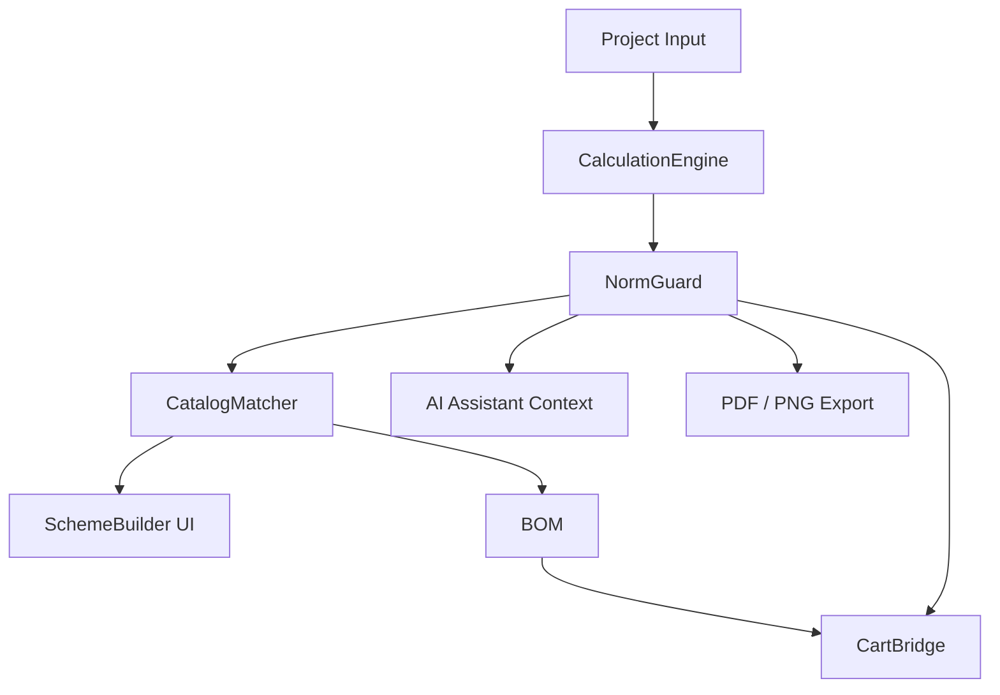

# Ревью безопасности инженерного калькулятора и схемостроителя Elektronom

Дата: 2026-05-31  
Объект ревью: `/uk/calculators`, `src/lib/engineering/*`, `src/components/engineering/engineering-workspace.tsx`

## 1. Вывод

Текущий модуль является хорошим MVP-калькулятором, но пока не является безопасным нормо-контролируемым схемостроителем.

Главный риск: сейчас расчётное ядро подбирает кабель, автомат, УЗО/диф и щит по упрощённым эвристикам. Оно предупреждает о части проблем, но не блокирует недопустимые решения системно. Для реального продукта нужен отдельный слой `NormGuard`, который проверяет каждый компонент, линию, щит и итоговую спецификацию до добавления в корзину, экспорта PDF или передачи AI-помощнику.

## 2. Нормативная база для MVP

Использовать не “мнение модели”, а версионированный профиль норм:

- `UA_DBИ_PUE_2017` — Украина, гражданские объекты, базовый профиль.
- `IEC_60364_BASE` — международный справочный профиль.
- `PROJECT_DRAFT` — режим чернового расчёта, где система показывает предупреждения и требует подтверждения электрика.

Источники:

- Приказ Минэнергоугля Украины № 476 от 21.07.2017 утвердил Правила устройства электроустановок, документ указан как действующий на сайте Верховной Рады Украины: https://zakon.rada.gov.ua/go/v0476732-17
- ДБН В.2.5-23:2010 распространяется на проектирование электроснабжения, освещения и силового электрооборудования гражданских объектов; также указывает, что защитные меры электробезопасности предусматриваются по ДБН В.2.5-27 и главе 1.7 ПУЭ: https://dnaop.com/html/32522/doc-%D0%94%D0%91%D0%9D_%D0%92.2.5-23_2010
- ДБН В.2.5-23:2010 указывает питание гражданских зданий от сети 380/220 В с системами заземления TN-S или TN-C-S: https://dnaop.com/html/32522/doc-%D0%94%D0%91%D0%9D_%D0%92.2.5-23_2010
- IEC 60364-1 задаёт правила проектирования, монтажа и проверки низковольтных электроустановок для безопасности людей, животных и имущества: https://webstore.iec.ch/en/publication/1865
- IEC 60364-7-701 применяется к помещениям с ванной или душем и описывает зоны вокруг ванны/душа: https://webstore.iec.ch/en/publication/28906
- Обзор Schneider Electric Electrical Installation Guide подчёркивает, что жилые электроустановки требуют высокого уровня безопасности и что локальные нормы обязательны: https://www.electrical-installation.org/enwiki/Residential_electrical_installation

## 3. Что сейчас недопустимо в архитектуре

### P0. Нет слоя нормативной валидации

Сейчас `buildEngineeringProject()` сразу строит линии, рекомендации и BOM. Нужно разделить:

1. `CalculationEngine` — считает ток, падение напряжения, нагрузку.
2. `NormGuard` — проверяет допустимость решения.
3. `CatalogMatcher` — ищет товары только после нормо-проверки технической спецификации.
4. `SchemeBuilder` — визуализирует только валидную или явно помеченную проблемную схему.
5. `CartBridge` — добавляет в корзину только позиции без `P0_BLOCK`.

### P0. Нельзя считать решение “допустимым” без типа сети и заземления

В `EngineeringProjectInput` нет:

- системы заземления: `TN-S`, `TN-C-S`, `TN-C`, `TT`, `IT`;
- точки разделения PEN;
- наличия PE-проводника;
- типа объекта и категории надёжности;
- вводной мощности/лимита договора;
- предполагаемого тока КЗ и отключающей способности аппаратов.

Минимальный MVP должен по умолчанию разрешать только `TN-S` и `TN-C-S` для квартиры/дома. `TN-C` внутри квартиры/после вводного щита — блокировать как `P0_BLOCK` для новых решений.

### P0. Подбор защитного аппарата не проверяет кабель по допустимому току

Сейчас автомат выбирается по таблице сечения:

- 1.5 мм² -> 10 A;
- 2.5 мм² -> 16 A;
- 4 мм² -> 25 A;
- 6 мм² -> 32 A.

Это можно оставить как стартовый пресет, но нельзя считать достаточным. Нужны параметры:

- способ прокладки;
- число нагруженных жил;
- температура;
- группировка кабелей;
- материал проводника;
- тип изоляции;
- допустимый ток после поправочных коэффициентов.

Правило: `In protective device <= Iz corrected cable ampacity`. Если не выполняется — `P0_BLOCK`.

### P0. Нет проверки отключающей способности автоматов

Каталоговый товар должен иметь атрибуты:

- `breakingCapacityKa`;
- `standard`, например IEC/EN 60898-1 или IEC/EN 60947-2;
- `poles`;
- `curve`;
- `ratedCurrentA`.

Правило: `breakingCapacityKa >= prospectiveShortCircuitKa`. Если данных нет — минимум `P1_WARNING`, а для режима “готово к заказу” — `P0_BLOCK`.

### P0. Нет нормального контроля ванной/мокрых зон

Сейчас ванная получает диф 10 мА, но нет понятия зон и IP. Для схемостроителя нужны поля:

- помещение: bathroom, kitchen, outdoor, living, technical;
- зона ванной: outside, zone0, zone1, zone2, zone3/other;
- IP-рейтинг устройства;
- тип подключения: fixed, socket, lighting, water-heater.

Правила:

- оборудование в ванной должно проходить отдельный профиль `IEC_60364_7_701 / UA wet-zone`.
- розетки, светильники, бойлеры и аксессуары без подходящего IP и защитной меры должны блокироваться.
- если зона не указана, компонент в ванной получает `P1_NEEDS_LOCATION`, а экспорт/заказ полной схемы должен быть заблокирован.

### P1. УЗО/дифы подбираются слишком грубо

Нужно проверять:

- номинальный ток УЗО/дифа не ниже тока линии/вышестоящего автомата;
- чувствительность: для розеточных и мокрых зон требовать `<= 30 mA`, для особо чувствительных зон можно рекомендовать 10 mA как усиленный профиль;
- тип УЗО: минимум Type A для современных нагрузок с электроникой, Type AC помечать предупреждением или блокировать в усиленном профиле;
- число полюсов соответствует фазности;
- PE никогда не коммутируется.

### P1. Нет проверки суммарной мощности и одновременности

Сейчас есть предупреждение, если автомат линии больше вводного автомата. Но нет проверки:

- суммарного расчётного тока по фазам;
- перекоса фаз для 3-фазной схемы;
- вводного лимита договора;
- коэффициентов спроса/одновременности;
- перегруза вводного автомата.

Для MVP нужно хотя бы:

- `totalEstimatedCurrentA <= inputBreakerA * demandFactor`;
- для 3 фаз показывать таблицу L1/L2/L3;
- при перегрузе — `P0_BLOCK` для добавления всей спецификации в корзину.

### P1. Каталоговый товар не проверяется как технически допустимый компонент

Сейчас `scoreProduct()` ищет по словам. Это нормально для поиска кандидатов, но опасно для финального выбора.

Нужно ввести `EngineeringProductSpec` в каталоге:

```ts
{
  role: 'breaker' | 'rcd' | 'rcbo' | 'cable' | 'panel' | 'voltageRelay',
  ratedCurrentA?: number,
  poles?: '1P' | '1P+N' | '2P' | '3P' | '3P+N' | '4P',
  curve?: 'B' | 'C' | 'D',
  leakageMa?: 10 | 30 | 100 | 300,
  rcdType?: 'AC' | 'A' | 'F' | 'B',
  breakingCapacityKa?: number,
  cableSectionMm2?: number,
  cableCores?: number,
  conductorMaterial?: 'Cu' | 'Al',
  ipRating?: string,
  modules?: number,
  standards?: string[]
}
```

Финальный выбор товара должен идти не по текстовому совпадению, а по `role + exact technical attributes`. Текстовый score оставить только для ранжирования внутри уже валидных кандидатов.

## 4. Матрица блокировок и предупреждений

### P0_BLOCK — нельзя добавить в корзину / экспортировать как проект

- Нет PE для линии, где PE обязателен.
- Система `TN-C` выбрана для внутренних новых групп квартиры/дома.
- Автомат больше допустимого тока кабеля.
- Отключающая способность автомата меньше расчётного тока КЗ.
- Розеточная/мокрая линия без УЗО/дифа `<= 30 mA`.
- Ванная/душ без указания зоны для электроточки.
- Компонент в ванной имеет недостаточный IP или неизвестный IP.
- 1-фазный аппарат поставлен на 3-фазную линию или наоборот.
- PE проводник коммутируется или проходит через УЗО/автомат как рабочий проводник.
- Суммарный расчётный ток превышает вводной лимит без решения по распределению/приоритетам.

### P1_WARNING — можно продолжить только с явным предупреждением

- Падение напряжения выше принятого лимита профиля.
- Не указан способ прокладки кабеля, используются консервативные значения.
- Нет данных о токе КЗ, отключающая способность не подтверждена.
- УЗО Type AC на современных электронных нагрузках.
- Щит имеет резерв менее 20-30%.
- Слишком много групп под одним УЗО.
- Длина трассы введена приблизительно.

### P2_INFO — информационные подсказки

- Рекомендовать отдельную линию для бойлера, духовки, варочной поверхности, кондиционера.
- Рекомендовать УЗИП/реле напряжения.
- Рекомендовать маркировку линий и запас модулей.
- Рекомендовать проверку специалистом перед монтажом.

## 5. Требования к UI схемостроителя

### 5.1 Значки и визуальные состояния

Каждый компонент схемы должен иметь нормо-статус:

- зелёный щит: `OK`;
- жёлтый треугольник: `WARNING`;
- красный стоп: `BLOCKED`;
- серый вопрос: `UNKNOWN_DATA`;
- синий info: `RECOMMENDATION`.

Нельзя скрывать проблему в общем списке. Значок должен быть:

- на самой линии;
- на конкретном компоненте щита;
- в BOM;
- в кнопке “Добавить в корзину”.

### 5.2 Поведение при недопустимом компоненте

Если пользователь вручную заменяет компонент:

1. Система пересчитывает нормо-статус.
2. Если компонент недопустим — блок подсвечивается красным.
3. Открывается понятное объяснение: “Автомат C32 нельзя ставить на кабель 3x2.5 мм²: номинал аппарата выше допустимого тока линии”.
4. Кнопка “Принять замену” отключена.
5. Показываются допустимые альтернативы из каталога.

### 5.3 Связь с AI-помощником

AI не должен самостоятельно утверждать норму. Он должен получать результат `NormGuard` как источник истины:

```ts
assistantContext = {
  project,
  normIssues,
  allowedActions,
  blockedActions,
  citations
}
```

AI может:

- объяснять предупреждение;
- предлагать безопасную замену из списка допустимых альтернатив;
- задавать уточняющие вопросы.

AI не может:

- снять `P0_BLOCK`;
- добавить заблокированный компонент в корзину;
- заменить нормы “по просьбе пользователя”.

## 6. Предлагаемая архитектура



### Модули

- `src/lib/engineering/norms/types.ts`
- `src/lib/engineering/norms/profiles/ua-dbn-pue-2017.ts`
- `src/lib/engineering/norms/rules.ts`
- `src/lib/engineering/norms/validate-project.ts`
- `src/lib/engineering/norms/validate-component.ts`
- `src/components/engineering/norm-status-icon.tsx`
- `src/components/engineering/norm-issue-panel.tsx`
- `src/components/engineering/component-replacement-panel.tsx`

## 7. Минимальный Sprint 1

1. Добавить в `EngineeringProjectInput`:
   - `earthingSystem`;
   - `supplyVoltage`;
   - `contractPowerKw`;
   - `prospectiveShortCircuitKa`;
   - `installationMethod`;
   - `ambientTemperatureC`;
   - `cableGroupingFactor`;
   - `normProfile`.

2. Добавить `NormIssue`:

```ts
interface NormIssue {
  id: string
  severity: 'info' | 'warning' | 'block'
  targetType: 'project' | 'line' | 'component' | 'bomItem'
  targetId: string
  code: string
  message: string
  remediation: string
  sourceRefs: string[]
}
```

3. Реализовать первые правила:
   - breaker <= cable ampacity;
   - RCD <= 30 mA для розеток и мокрых зон;
   - phase/poles compatibility;
   - PE required;
   - voltage drop warning;
   - panel reserve warning;
   - no catalog product without required technical attributes.

4. В UI:
   - показать значки статуса на линиях;
   - показать отдельную панель “Нормо-контроль”;
   - заблокировать “Добавить найденное в корзину”, если есть `P0_BLOCK`;
   - у каждой ошибки дать кнопку “Показать допустимые варианты”.

5. В тестах:
   - C32 на 2.5 мм² должен блокироваться;
   - ванная без УЗО должна блокироваться;
   - товар без `breakingCapacityKa` не должен быть финально допустимым в режиме заказа;
   - 3-фазная линия не должна принимать 1-фазный автомат;
   - отсутствие PE должно блокировать розеточные линии.

## 8. Sprint 2

- Визуальный DIN-щит: модули, ряды, маркировка, красные/жёлтые статусы прямо на аппаратах.
- Режим ручной замены компонентов с norm-check preview.
- Экспорт PDF/PNG с нормо-статусами.
- Админка для заполнения технических атрибутов товаров.
- Страница “качество каталога для схемостроителя”: товары без `role`, `ratedCurrentA`, `breakingCapacityKa`, `poles`, `standards`.

## 9. Рекомендация

Не выпускать текущий `/calculators` как “готовый подбор электрощита”. Его можно показывать как “черновой инженерный калькулятор”.

Для настоящего прода нужно первым делом реализовать `NormGuard` и связать его с UI, каталогом, корзиной и AI. Тогда инструмент станет не просто красивым конфигуратором, а безопасным нормо-контролируемым помощником.
