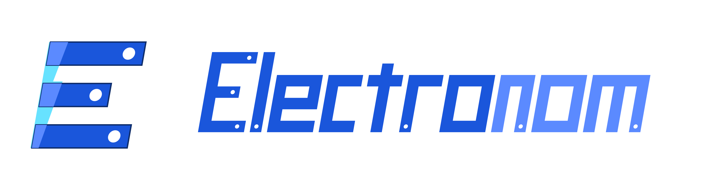

# TASK: Replace Elektronom Logo

Date: 2026-05-24
Project: Elektronom

## Reference Logo

Use the provided real logo files. Do not redraw or reinterpret the logo from memory.

Attached source assets:



Files:

- `public/logo/electronom-logo-source.svg`
- `public/logo/electronom-logo-source.png`

Important: `electronom-logo-source.svg` and `electronom-logo-source.png` are the provided source/reference files. Use these as the design authority. The developer may optimize/crop/export production variants from the SVG, but must not invent a different mark or wordmark.

## Goal

Replace the current header brand mark/text (`Zap` icon + `ЕЛЕКТРОНОМ.` text) with the provided `Electronom` logo.

## Places To Check And Replace

Update every place where the old logo/brand mark appears:

- desktop header;
- mobile header;
- sticky header state;
- footer if it contains the old logo;
- login/register/admin brand blocks if present;
- favicon/app icon if current icon is still the old mark;
- any Open Graph/static brand image only if it uses the old logo.

Primary file expected:

- `src/components/layout/header.tsx`

Also search the repository for:

```powershell
rg -n "ЕЛЕКТРОНОМ|Zap|header-logo|favicon|logo" src public
```

## Required Final Assets

Prepare final optimized production files:

- `public/logo/electronom-logo.svg` — full horizontal logo;
- `public/logo/electronom-mark.svg` — mark only, stylized `E`;
- `public/logo/electronom-logo-light.svg` — light version for dark backgrounds if needed;
- `public/logo/favicon.svg` — favicon based on the mark, if favicon is updated.

Use the provided source files as input:

- source SVG: `public/logo/electronom-logo-source.svg`;
- source PNG preview: `public/logo/electronom-logo-source.png`.

SVG requirements:

- valid `viewBox`;
- no editor metadata;
- no embedded raster/base64;
- optimized paths;
- no broken font dependency for production wordmark, unless converted to paths;
- visually sharp at desktop and mobile sizes.

## Visual Requirements

The final logo must match the provided source:

- mark: geometric/stylized `E`, blue/cyan layered plates, white circular highlights;
- wordmark: italic technical lettering;
- `Electro` part in deep blue;
- `nom` part in cyan;
- preserve proportions and spacing from the reference;
- do not mix the old lightning `Zap` icon with the new mark.

Recommended colors:

- blue: close to `#2457D6` or project accent if visually consistent;
- cyan: close to `#12BFEA`;
- white highlights: `#FFFFFF`.

## Header Integration

Replace the old brand block in `src/components/layout/header.tsx`.

Current pattern to remove:

- `Zap` icon;
- text `ЕЛЕКТРОНОМ.`;
- old dot styling.

Expected behavior:

- logo link points to localized home: `/uk` or `/ru`;
- desktop shows the full horizontal logo;
- mobile may show compact full logo or mark-only version if space is tight;
- header height must not change unexpectedly;
- logo must not blur, stretch, crop, or overlap search/navigation.

Use either:

- inline SVG component, preferred if it keeps styling/control clean; or
- `next/image` with SVG asset from `public/logo`.

## Accessibility

Logo link:

- Ukrainian aria-label: `Electronom — головна`;
- Russian aria-label: `Electronom — главная`.

Image alt:

- if the link has a good aria-label, image can use `alt=""`;
- otherwise use `alt="Electronom"`.

## Localization / Brand Text

Do not translate the wordmark. The brand name is:

`Electronom`

Do not use:

- `ЕЛЕКТРОНОМ.`;
- mixed old/new brand blocks;
- old lightning icon next to the new logo.

## Responsive Acceptance

Check:

- desktop 1440px;
- laptop 1280px;
- tablet;
- mobile 390px;
- sticky header after scroll.

The logo must:

- remain readable;
- keep aspect ratio;
- not push search, wishlist, account, cart, or burger menu out of place;
- not increase CLS.

## Technical Checks

Run:

```powershell
npm.cmd run lint
npx.cmd tsc --noEmit
npm.cmd run build
```

## Manual Proof Required

Developer must provide screenshots:

- `/uk` desktop header;
- `/uk` mobile header;
- `/ru` desktop header;
- sticky header state after scroll;
- favicon/browser tab if favicon changed.

## Acceptance

The replacement is accepted when:

- old `Zap + ЕЛЕКТРОНОМ.` logo is gone from the header;
- new `Electronom` logo matches `electronom-logo-source.svg/png`;
- final SVG files exist in `public/logo`;
- mobile/desktop header layout remains stable;
- lint, TypeScript, and production build pass.
