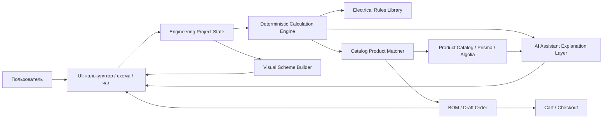

# ТЗ: единая инженерная платформа калькуляторов, схем, каталога и AI-помощника

Дата: 2026-05-31  
Проект: Elektronom  
Статус: технологическое ТЗ для разработки  
Цель: сделать не набор отдельных виджетов, а связанную систему, где калькуляторы, визуальная схема, подбор товаров из каталога, BOM, корзина и AI-помощник работают совместно.

## 1. Идея модуля

Нужно разработать инженерный модуль Elektronom, который помогает пользователю:

1. Описать объект: квартира, дом, офис, гараж, серверная, система резервного питания.
2. Рассчитать электрические параметры: ток, кабель, автомат, УЗО/диф, щит, UPS, освещение.
3. Построить визуальную схему: ввод, защита, линии, помещения, нагрузки.
4. Подобрать реальные товары из каталога сайта.
5. Сформировать BOM/спецификацию.
6. Дать возможность заменить товары на аналоги.
7. Добавить BOM в корзину.
8. Сохранить проект.
9. Получить объяснение от AI-помощника.

Главный принцип: AI не должен сам “выдумывать расчет”. AI должен работать поверх deterministic calculation engine и каталога.



## 2. Что должно быть единым

Нельзя делать отдельно:

- калькулятор кабеля сам по себе;
- калькулятор автомата сам по себе;
- AI-чат сам по себе;
- схема сама по себе;
- подбор товаров сам по себе.

Нужен общий объект проекта:

```ts
type EngineeringProject = {
  id: string
  locale: 'uk' | 'ru'
  projectType: 'apartment' | 'house' | 'office' | 'garage' | 'backup_power' | 'custom'
  input: EngineeringProjectInput
  rooms: EngineeringRoom[]
  loads: EngineeringLoad[]
  lines: EngineeringLine[]
  panel: ElectricalPanelPlan
  calculations: CalculationResult[]
  recommendations: ProductRecommendation[]
  bom: EngineeringBOM
  warnings: EngineeringWarning[]
  version: number
  createdAt: string
  updatedAt: string
}
```

Все части системы читают и изменяют этот проект.

## 3. Основные сценарии

### 3.1. Пользователь начинает с калькулятора

Пример: пользователь открывает `/uk/calculators/cable`.

1. Вводит мощность, длину линии, тип прокладки.
2. Система считает ток, сечение, падение напряжения.
3. Система создает `EngineeringLine`.
4. Product Matcher подбирает кабель из каталога.
5. BOM получает позицию кабеля.
6. Пользователь нажимает “Добавить в схему”.
7. Схема обновляется.
8. AI может объяснить, почему выбран именно этот кабель.

### 3.2. Пользователь начинает со схемы квартиры

Пример: пользователь открывает `/uk/calculators/home-scheme`.

1. Вводит: квартира 64 м², 2 комнаты, кухня с духовым шкафом, ванная, бойлер.
2. Система генерирует линии:
   - освещение;
   - розетки комнат;
   - кухня розетки;
   - духовой шкаф;
   - бойлер;
   - ванная;
   - резерв/слаботочка.
3. Calculation Engine считает кабели, автоматы, УЗО/дифы.
4. Product Matcher подбирает товары.
5. Scheme Builder строит схему щита.
6. BOM показывает товары и сумму.
7. Пользователь заменяет отдельные позиции.
8. AI объясняет риски и предлагает уточнения.

### 3.3. Пользователь начинает с AI-чата

Пример: “Нужна схема электрики для квартиры 42 м², бойлер 2 кВт, стиралка, кухня”.

1. AI извлекает структурированные параметры из текста.
2. AI не считает сам, а вызывает Calculation Engine.
3. Calculation Engine строит проект.
4. UI показывает схему, BOM, предупреждения.
5. AI объясняет результат и задает уточняющие вопросы только по недостающим данным.

## 4. Архитектура модулей

Создать структуру:

```text
src/lib/engineering/
  types.ts
  constants.ts
  rules/
    cable-rules.ts
    breaker-rules.ts
    rcd-rules.ts
    panel-rules.ts
    ups-rules.ts
    lighting-rules.ts
  calculators/
    cable-calculator.ts
    breaker-calculator.ts
    rcd-calculator.ts
    panel-calculator.ts
    ups-calculator.ts
    lighting-calculator.ts
    home-scheme-calculator.ts
  matcher/
    product-matcher.ts
    catalog-query-builder.ts
    recommendation-ranker.ts
  scheme/
    scheme-builder.ts
    scheme-layout.ts
    scheme-export.ts
  bom/
    bom-builder.ts
    bom-pricing.ts
    cart-sync.ts
  ai/
    project-extractor.ts
    explanation-builder.ts
    tool-router.ts
```

UI:

```text
src/app/[locale]/calculators/page.tsx
src/app/[locale]/calculators/cable/page.tsx
src/app/[locale]/calculators/breaker/page.tsx
src/app/[locale]/calculators/rcd/page.tsx
src/app/[locale]/calculators/ups/page.tsx
src/app/[locale]/calculators/lighting/page.tsx
src/app/[locale]/calculators/home-scheme/page.tsx

src/components/engineering/
  engineering-workspace.tsx
  calculator-tabs.tsx
  cable-calculator-form.tsx
  breaker-calculator-form.tsx
  rcd-calculator-form.tsx
  ups-calculator-form.tsx
  lighting-calculator-form.tsx
  home-scheme-wizard.tsx
  scheme-canvas.tsx
  scheme-node.tsx
  panel-layout-view.tsx
  bom-panel.tsx
  bom-item-card.tsx
  product-replacement-modal.tsx
  engineering-ai-panel.tsx
  engineering-warning-list.tsx
```

Server actions / route handlers:

```text
src/actions/engineering.ts
src/app/api/engineering/assistant/route.ts
```

## 5. Общие типы

### 5.1. Нагрузка

```ts
type EngineeringLoad = {
  id: string
  roomId?: string
  name: string
  kind:
    | 'lighting'
    | 'socket_group'
    | 'boiler'
    | 'washing_machine'
    | 'dishwasher'
    | 'oven'
    | 'hob'
    | 'conditioner'
    | 'warm_floor'
    | 'router'
    | 'camera'
    | 'server'
    | 'custom'
  powerW: number
  voltage: 230 | 400
  phase: 1 | 3
  demandFactor?: number
  critical?: boolean
  wetZone?: boolean
}
```

### 5.2. Линия

```ts
type EngineeringLine = {
  id: string
  name: string
  loads: string[]
  phase: 1 | 3
  voltage: 230 | 400
  totalPowerW: number
  calculatedCurrentA: number
  cable: CableSelection
  breaker: BreakerSelection
  rcd?: RcdSelection
  routeLengthM?: number
  voltageDropPct?: number
  warnings: EngineeringWarning[]
}
```

### 5.3. Рекомендация товара

```ts
type ProductRecommendation = {
  id: string
  role:
    | 'cable'
    | 'breaker'
    | 'rcd'
    | 'dif_breaker'
    | 'panel'
    | 'voltage_relay'
    | 'busbar'
    | 'terminal'
    | 'accessory'
    | 'ups'
    | 'battery'
    | 'lighting'
  lineId?: string
  requiredSpec: Record<string, string | number | boolean>
  selectedProductId?: string
  alternatives: ProductAlternative[]
  reason: string
  confidence: number
  warnings: EngineeringWarning[]
}
```

### 5.4. BOM

```ts
type EngineeringBOM = {
  groups: EngineeringBOMGroup[]
  subtotal: number
  unavailableItems: ProductRecommendation[]
  warnings: EngineeringWarning[]
}

type EngineeringBOMGroup = {
  id: string
  title: string
  role: ProductRecommendation['role']
  items: EngineeringBOMItem[]
}

type EngineeringBOMItem = {
  productId: string
  sku: string
  name: string
  qty: number
  unitPrice: number
  total: number
  stock: number
  reason: string
  replacementAllowed: boolean
}
```

## 6. Расчетный движок

### 6.1. Принцип

Расчеты должны быть deterministic:

- входные данные;
- формула;
- результат;
- предупреждения;
- выбранные товары.

AI может:

- объяснить результат;
- задать уточнение;
- предложить альтернативу;
- сформировать текстовое резюме.

AI не может:

- менять формулы без правил;
- придумывать товар, которого нет в каталоге;
- придумывать цену/остаток;
- скрывать предупреждения.

### 6.2. Базовые формулы

Однофазный ток:

```text
I = P / U
```

Трехфазный ток:

```text
I = P / (sqrt(3) * U * cosφ)
```

Падение напряжения MVP:

```text
ΔU% = (2 * L * I * ρ) / (S * U) * 100
```

Для трехфазной сети использовать соответствующую формулу с `sqrt(3)`.

В MVP:

- `U = 230` для 1 фазы;
- `U = 400` для 3 фаз;
- `cosφ = 0.95`;
- материал по умолчанию медь;
- допустимое падение напряжения 3-5%, настраиваемо.

## 7. Product Matcher

Product Matcher связывает расчет с каталогом.

### 7.1. Требования

Он должен:

1. Искать только активные товары.
2. Учитывать наличие.
3. Учитывать категорию.
4. Учитывать технические атрибуты товара.
5. Возвращать выбранный товар и альтернативы.
6. Объяснять причину выбора.
7. Не отдавать пользователю товар, который не соответствует минимальным требованиям.

### 7.2. Пример поиска кабеля

Вход:

```ts
{
  role: 'cable',
  requiredSpec: {
    cores: 3,
    sectionMm2: 2.5,
    material: 'copper',
    cableType: 'vvgng',
  }
}
```

Поиск:

- категория `kabel-ta-provid`;
- атрибут `section=2.5`;
- атрибут `cores=3`;
- `stock > 0`;
- сортировка: соответствие -> наличие -> цена -> бренд.

### 7.3. Пример поиска автомата

Вход:

```ts
{
  role: 'breaker',
  requiredSpec: {
    currentA: 16,
    curve: 'C',
    poles: '1P',
  }
}
```

Поиск:

- категория автоматов;
- `current=16A`;
- `curve=C`;
- `poles=1P`;
- `stock > 0`.

## 8. Схемостроение

### 8.1. Задача

Визуализация должна показывать понятную схему, а не просто список товаров.

MVP-схема:

```text
Ввод
  -> Вводной автомат
  -> Реле напряжения
  -> УЗО/диф-группы
      -> Освещение
      -> Розетки комнат
      -> Кухня
      -> Ванная
      -> Бойлер
      -> Духовой шкаф
      -> Резерв
```

### 8.2. UI-состояния

Схема должна поддерживать:

- normal;
- warning;
- error;
- selected;
- replaced;
- unavailable product;
- missing catalog match.

### 8.3. Визуальные элементы

Node types:

- source;
- meter;
- main breaker;
- voltage relay;
- rcd;
- dif breaker;
- breaker;
- cable line;
- load;
- room;
- panel;
- accessory.

### 8.4. Библиотека визуализации

Рекомендация для MVP:

- использовать React-компоненты + SVG.

Для более сложного редактора:

- рассмотреть React Flow, если нужна drag-and-drop логика;
- но не тащить сложную библиотеку, если MVP можно сделать статической схемой.

## 9. AI-помощник как координационный слой

### 9.1. AI tools

AI должен работать через инструменты:

```ts
type EngineeringAITool =
  | 'extract_project_input'
  | 'run_cable_calculation'
  | 'run_breaker_calculation'
  | 'run_rcd_calculation'
  | 'build_home_scheme'
  | 'match_catalog_products'
  | 'replace_product'
  | 'explain_result'
  | 'add_bom_to_cart'
```

### 9.2. Поведение AI

AI должен:

- задавать уточняющие вопросы, если данных не хватает;
- ссылаться на рассчитанные значения;
- показывать предупреждения;
- предлагать товары только из результата Product Matcher;
- объяснять, почему товар выбран;
- уметь заменить товар по просьбе пользователя;
- сохранять проект/BOM.

AI не должен:

- обещать финальную проектную документацию;
- подменять электрика;
- придумывать нормы;
- скрывать неопределенность;
- рекомендовать товар без проверки каталога.

### 9.3. Пример AI-сценария

Пользователь:

```text
Сделай схему для квартиры 42 м², бойлер 2 кВт, стиралка, кухня, 1 фаза.
```

AI:

1. Извлекает `EngineeringProjectInput`.
2. Вызывает `build_home_scheme`.
3. Получает линии и расчеты.
4. Вызывает `match_catalog_products`.
5. Возвращает:
   - схему;
   - BOM;
   - предупреждения;
   - вопросы, если данных не хватает.

## 10. Связь с корзиной

Из BOM должна быть кнопка:

- “Добавить все в корзину”;
- “Добавить выбранные”;
- “Заменить недоступные”;
- “Сохранить проект”.

Перед добавлением:

- проверить stock;
- если товара нет, предложить альтернативу;
- если цена изменилась, показать предупреждение;
- если товар удален/неактивен, не добавлять.

## 11. Сохранение проекта

### MVP

До авторизации:

- localStorage;
- export JSON;
- восстановление черновика.

После авторизации:

- сохранить в аккаунт.

### DB-модель на следующий этап

```prisma
model EngineeringProject {
  id        String   @id @default(cuid(2))
  userId    String?
  locale    String
  type      String
  title     String
  input     Json
  state     Json
  bom       Json
  createdAt DateTime @default(now())
  updatedAt DateTime @updatedAt
}
```

Не добавлять Prisma-модель без миграции и без отдельного ревью.

## 12. API / Server Actions

Создать `src/actions/engineering.ts`:

```ts
export async function calculateCableAction(input: CableCalculatorInput)
export async function calculateBreakerAction(input: BreakerCalculatorInput)
export async function calculateRcdAction(input: RcdCalculatorInput)
export async function buildHomeSchemeAction(input: HomeSchemeInput)
export async function matchProductsForProjectAction(project: EngineeringProject)
export async function addEngineeringBomToCartAction(bom: EngineeringBOM)
```

Правила:

- все input через Zod;
- IDs через `z.string().min(1)`, не `.cuid()`;
- Prisma queries только с `select`;
- collection queries с `take`;
- не использовать `include`;
- product matching должен обновляться при изменении каталога.

## 13. UI страницы

### `/[locale]/calculators`

Первый экран должен быть инструментом, а не лендингом.

Блоки:

- “Схема квартиры/дома”;
- “Кабель”;
- “Автомат”;
- “УЗО/диф”;
- “UPS/резервное питание”;
- “Освещение”.

Справа/снизу:

- последние проекты;
- корзина проекта;
- AI-помощник.

### `/[locale]/calculators/home-scheme`

Desktop layout:

```text
Левая панель: параметры
Центр: схема
Правая панель: BOM + товары
Низ: предупреждения
```

Mobile layout:

```text
Шаг 1: объект
Шаг 2: нагрузки
Шаг 3: схема
Шаг 4: товары
Шаг 5: корзина/экспорт
```

## 14. Безопасность и юридическая осторожность

Обязательно показывать:

```text
Розрахунок є попереднім. Перед монтажем перевірте рішення з кваліфікованим електриком.
```

RU:

```text
Расчет предварительный. Перед монтажом проверьте решение с квалифицированным электриком.
```

Не писать:

- “гарантированно безопасно”;
- “можно монтировать без проверки”;
- “соответствует всем нормам” без полноценной нормативной базы.

## 15. Тестирование

### Unit tests

- cable current;
- voltage drop;
- breaker selection;
- RCD selection;
- panel module count;
- BOM subtotal;
- product matcher scoring.

### Integration tests

- расчет -> product matching -> BOM;
- BOM -> cart;
- AI prompt -> structured project -> calculation;
- сохранение/восстановление проекта;
- отсутствие товара -> альтернатива.

### Visual tests

- схема desktop;
- схема mobile;
- BOM panel;
- replacement modal;
- warnings.

## 16. Приоритеты разработки

### Sprint 1: основа

1. Создать `/calculators`.
2. Создать типы `src/lib/engineering/types.ts`.
3. Сделать deterministic cable/breaker/rcd calculators.
4. Сделать product matcher для cable/breaker/rcd.
5. Сделать BOM panel.
6. Убрать 404 по ссылке из header.

### Sprint 2: схема квартиры/дома

1. Home scheme wizard.
2. Генерация линий.
3. Схема щита.
4. BOM по линиям.
5. Замена товаров.

### Sprint 3: AI-интеграция

1. AI extraction to `EngineeringProjectInput`.
2. AI tool router.
3. AI explanations.
4. AI replace product flow.

### Sprint 4: сохранение и экспорт

1. Local drafts.
2. Save to account.
3. PDF/PNG/CSV export.
4. Add all to cart.

### Sprint 5: production scaling

1. Нормализованные технические атрибуты.
2. Админ-маппинг правил к категориям.
3. Algolia/Meilisearch facet integration.
4. Версионирование правил.

## 17. Acceptance criteria

1. `/uk/calculators` и `/ru/calculators` работают.
2. Ссылка в header не ведет на 404.
3. Кабельный калькулятор выдает расчет и реальные товары.
4. Калькулятор автомата проверяет кабель и нагрузку.
5. Калькулятор УЗО/дифа учитывает мокрые зоны.
6. Home scheme строит минимум 5 линий для квартиры.
7. Схема визуально показывает ввод, защиту и группы.
8. BOM содержит реальные товары из каталога.
9. Можно заменить товар на альтернативу.
10. Можно добавить BOM в корзину.
11. AI может объяснить расчет, но не подменяет calculation engine.
12. Все предупреждения видны пользователю.
13. На mobile сценарий работает пошагово.
14. Нет новых `style={{}}`.
15. `npm run lint`, `npx tsc --noEmit`, `npm run build` проходят.

## 18. Итог

Нужно строить не “калькулятор” и не “AI-чат”, а единую инженерную платформу:

```text
Project Input -> Calculation Engine -> Visual Scheme -> Catalog Matching -> BOM -> Cart -> AI Explanation
```

Тогда сайт получает сильное отличие от обычного интернет-магазина: он не просто продает товары, а помогает собрать технически осмысленный комплект под реальный объект.

