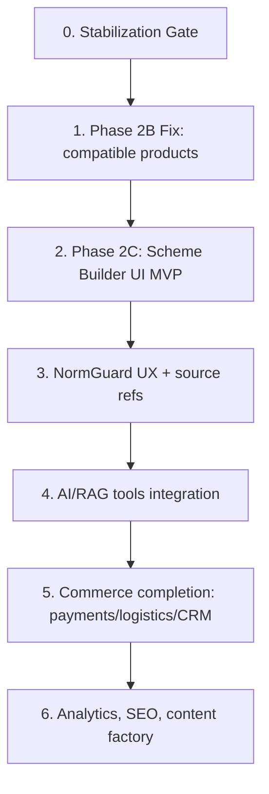
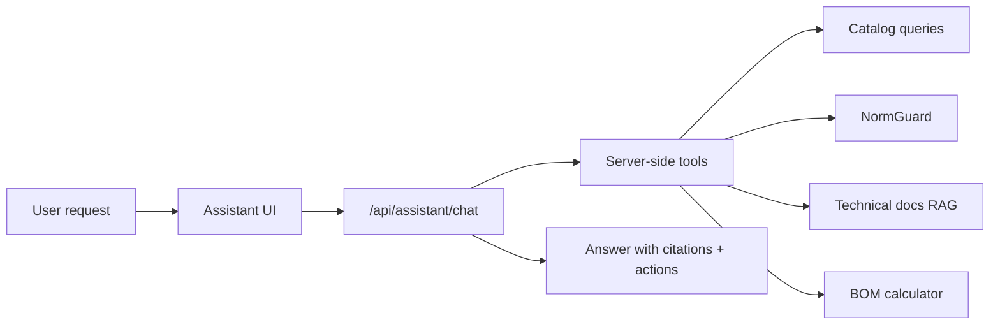

# Elektronom — ТЗ дальнейшей разработки

Дата: 2026-06-02  
Назначение: мастер-ТЗ для разработчиков на ближайшие этапы после текущих sprint/review работ.  
Связанные документы:

- `TECH_DOC_ELEKTRONOM_APP_2026-06-02.md`
- `TZ_ENGINEERING_PLATFORM_NEXT_SPRINT_NORMGUARD_SCHEME_AI_RAG_2026-05-31.md`
- `TZ_INTEGRATED_ENGINEERING_CALCULATORS_SCHEME_CATALOG_AI_2026-05-31.md`
- `TZ_ENTERPRISE_ROADMAP_2026-06-01.md`
- `TZ_STAGE1_OPERATIONAL_MATURITY_2026-06-01.md`
- `TZ_STAGE2_SCALE_COMMERCE_2026-06-01.md`
- `TZ_STAGE3_DIFFERENTIATION_2026-06-01.md`
- `TZ_STAGE4_AUTHORITY_2026-06-01.md`
- `REVIEW_SPRINT2_PHASE2B_COMPATIBLE_PRODUCTS_RECHECK_2026-06-01.md`

## 1. Главная цель

Довести Elektronom до уровня технического commerce-продукта, где пользователь может:

1. Найти товар через каталог, фильтры, поиск или AI.
2. Проверить совместимость товара с задачей, схемой и нормами.
3. Собрать комплект/щит/низковольтную схему в визуальном builder.
4. Получить BOM, цену, предупреждения, аналоги и ссылки на технические источники.
5. Добавить корректный комплект в корзину и оформить заказ.
6. Для B2B — получить счет, КП, доставку, статус заказа и документы.

Принцип: AI помогает, но не принимает safety-решения. Все критичные электротехнические блокировки определяются детерминированным NormGuard.

## 2. Порядок разработки

Нельзя прыгать сразу в красивый Scheme Builder, пока не закрыта надежность catalog binding и тестовая изоляция. Рекомендуемый порядок:



## 3. Sprint 0 — Stabilization Gate

### 3.1 Задачи

1. Настроить безопасный test workflow:
   - `TEST_DATABASE_URL`;
   - запрет DB-mutating тестов без explicit flag;
   - CI job для unit tests;
   - отдельный integration job для DB tests.
2. Убрать текущие lint warnings или задокументировать как accepted debt.
3. Проверить `npm run build`, `npx tsc --noEmit`, `npm run lint`, `npm run test`, `npm run test:jsonb`, `npm run test:engineering`.
4. Создать developer checklist для каждого PR.

### 3.2 Acceptance Criteria

- Обычный `npm run test:engineering` не пишет в основную БД.
- DB tests работают только на тестовой БД или через явный флаг.
- CI не пропускает PR с failing tests.
- В README или `docs/` описан test setup.

## 4. Sprint 1 — Закрыть Phase 2B Catalog Compatible Products

### 4.1 Контекст

`findCompatibleProducts` нужен для связи схемотехники и реального каталога. Сейчас его нельзя считать принятым, пока DB-backed test не воспроизводится безопасно.

### 4.2 Задачи

1. Переписать DB-backed тест:
   - использовать `TEST_DATABASE_URL`;
   - seed через transaction или отдельную test schema;
   - cleanup должен быть гарантированным;
   - если test DB отсутствует, integration block skip с явным сообщением.
2. Проверить `findCompatibleProducts`:
   - role mapping;
   - JSONB filter или normalized field;
   - deterministic `orderBy`;
   - public attribute projection;
   - stable error codes.
3. Синхронизировать названия engineering attributes:
   - `currentA` vs `ratedCurrentA`;
   - `leakageMa` vs `leakageMA`;
   - `sectionMm2`;
   - `poles`;
   - `curve`;
   - `modules`;
   - `certifications`, `standard`, `manufacturerDoc`, `safetySource`.
4. Добавить admin UI для редактирования engineering metadata товара.

### 4.3 Acceptance Criteria

- `findCompatibleProducts` возвращает реальные товары из тестовой БД.
- Тест проверяет:
  - минимум 2 результата;
  - role match;
  - score > 0;
  - сортировку по score desc;
  - qualityGate;
  - public projection;
  - stable errors.
- Нет raw Prisma/database error на клиенте.
- Attribute naming documented в отдельном `ENGINEERING_PRODUCT_ATTRIBUTES.md`.

## 5. Sprint 2 — Scheme Builder UI MVP

### 5.1 Цель

Сделать визуальный конструктор схем для квартиры/дома/малого объекта, связанный с:

- custom loads;
- EngineeringGraph;
- NormGuard;
- каталогом;
- BOM;
- AI assistant.

**Key clarification for Sprint 2:** this module must provide a real project drawing field, not only calculators and load forms. The user must work on a visual sheet/canvas where electrical components are placed, connected, checked by NormGuard, converted into BOM, and then synchronized with the cart.

### 5.2 Функциональность

Пользователь должен иметь возможность:

1. Создать проект:
   - квартира;
   - частный дом;
   - мастерская/гараж;
   - резервное питание;
   - низковольтная сеть.
2. Добавить потребителей:
   - освещение;
   - розеточные группы;
   - бойлер;
   - варочная поверхность;
   - кондиционер;
   - насос;
   - зарядная станция;
   - генератор;
   - инвертор/АКБ;
   - слаботочные устройства.
3. Разложить схему:
   - ввод;
   - счетчик;
   - вводной автомат;
   - УЗИП;
   - реле напряжения;
   - УЗО/дифавтомат;
   - автоматы линий;
   - кабельные линии;
   - шины N/PE;
   - клеммы;
   - АВР;
   - нагрузка.
4. Видеть предупреждения прямо на узлах схемы:
   - danger;
   - warning;
   - info;
   - blocker.
5. Получить BOM:
   - товары;
   - количество;
   - цена;
   - доступность;
   - аналоги;
   - недостающие safety-critical components.
6. Добавить в корзину только безопасный комплект.


### 5.2.1 Project Drawing Canvas

The builder must include a real project canvas/sheet, not only a calculation form. On this canvas the user places electrical components, connects them with lines/conductors, edits properties, and sees NormGuard warnings directly on the scheme.

Required canvas functions:

- create a new scheme sheet;
- templates: apartment, private house, backup power panel, low-voltage network;
- drag-and-drop components from palette to canvas;
- connect components with lines/conductors;
- connection types: L, N, PE, PEN, DC+, DC-, signal, bus;
- line properties: material, cross-section, length, core count, installation method as future field;
- grouping by panels, lines, rooms and floors;
- grid background, snap-to-grid, zoom/pan, undo/redo;
- save project as draft;
- future export: PNG/PDF for scheme and CSV/XLSX for BOM.

### 5.2.2 Drawing Component Library

Component palette groups:

- Sources: grid, generator, inverter, battery, solar input as future.
- Input and metering: meter, main breaker, SPD, voltage relay.
- Protection: MCB, RCD, RCBO, fuse as future.
- Switching: ATS 3P/4P, contactor, relay.
- Distribution: panel, DIN rail, N/PE busbars, terminal blocks.
- Cables and lines: cable line, conductor, low-voltage line.
- Loads: lighting, sockets, boiler, kitchen, HVAC, pump, EV charger, server/router/PoE.
- Low-voltage: CCTV, intercom, access control, alarm, network.

Each element must have nodeType, display name, icon/symbol, editable properties, allowed ports, port compatibility rules, optional catalog product binding, and warning state from NormGuard.

### 5.2.3 Drawing Project Model

Extend the current EngineeringGraph or add related EngineeringProjectDraft:

```ts
type EngineeringProjectDraft = {
  id: string
  name: string
  locale: 'uk' | 'ru'
  version: number
  sheets: EngineeringSheet[]
  graph: EngineeringGraph
  bom: EngineeringBOMItemSnapshot[]
  normIssues: NormIssue[]
  totals: EngineeringTotals
  updatedAt: string
}

type EngineeringSheet = {
  id: string
  name: string
  kind: 'single_line' | 'panel_layout' | 'low_voltage' | 'floor_plan'
  viewport: { x: number; y: number; zoom: number }
  nodes: EngineeringCanvasNode[]
  edges: EngineeringCanvasEdge[]
}
```

Canvas nodes and edges are view-layer data. Safety and calculations remain in EngineeringGraph, not inside the visual component library.
### 5.3 UI требования

Рекомендуемый layout desktop:

```text
┌─────────────────────────────────────────────────────────────┐
│ Project header: name, locale, save, export, AI help          │
├───────────────┬───────────────────────────────┬─────────────┤
│ Loads /       │ Canvas scheme builder          │ NormGuard / │
│ components    │ nodes + edges + warnings       │ BOM panel   │
│ palette       │                               │             │
└───────────────┴───────────────────────────────┴─────────────┘
```

Mobile:

- tabs: `Loads`, `Scheme`, `Warnings`, `BOM`, `AI`;
- no overlapping with bottom nav;
- warning badges remain visible;
- editing via bottom sheet.

### 5.4 Technical choices

Preferred:

- React Flow or equivalent graph canvas library;
- EngineeringGraph remains source of truth;
- UI nodes are view models derived from graph nodes;
- no safety logic inside canvas components; only visual rendering of NormGuard output.
- Project canvas state must be serializable to JSON.
- User actions must be represented as graph mutations, not ad-hoc DOM state.

### 5.5 Acceptance Criteria

- Создание/редактирование graph nodes работает без потери данных.
- A working project drawing canvas exists with component placement, port connections, and saved canvas state.
- MVP component palette exists: input, breaker, RCD, cable, load, panel, N/PE busbars, ATS, generator.
- Selected element property inspector exists.
- Undo/redo exists for basic operations: add node, move node, connect edge, delete.
- `runNormGuard(graph)` вызывается после каждого meaningful graph change.
- Узлы с нарушениями подсвечиваются.
- Нельзя добавить в корзину при `danger`/`blocker`.
- BOM обновляется при изменении схемы.
- Есть unit tests для graph transforms и visual smoke test для builder page.

## 6. Sprint 3 — NormGuard v3 и база норм

### 6.1 Цель

Сделать NormGuard не просто набором правил, а проверяемым safety engine с источниками.

### 6.2 Новые правила

Добавить проверки:

1. Тип сети и нейтраль:
   - TN-C, TN-S, TN-C-S, TT;
   - запрет некорректного PE/N bonding;
   - особенности генератора/инвертора.
2. ATS:
   - 3P vs 4P;
   - нужно ли коммутировать нейтраль;
   - сценарии с PEN/N/PE;
   - блокировка опасных конфигураций.
3. RCD/RCBO:
   - влажные зоны;
   - селективность;
   - leakage current;
   - тип AC/A/F/B, если данные есть.
4. Cable:
   - материал Cu/Al;
   - сечение;
   - длина;
   - допустимый ток;
   - падение напряжения;
   - способ прокладки как будущий параметр.
5. Terminals:
   - совместимость Al/Cu;
   - гибкий/монолит;
   - наконечники НШВИ;
   - диапазон сечений.
6. Panel:
   - количество DIN-модулей;
   - резерв;
   - тепловая загрузка как future rule.
7. Low-voltage:
   - слаботочные линии отдельно от силовых;
   - допустимость совместной прокладки;
   - PoE/power budget как future rule.

### 6.3 Источники

Каждое правило должно иметь:

- `sourceRefs`;
- `confidence`;
- `documentId`;
- `section`;
- `verifiedAt`;
- `titleKey/messageKey`;
- fix suggestions.

Источники для загрузки:

- ПУЕ/ДБН/IEC выдержки, если юридически можно хранить;
- инструкции производителей;
- datasheets;
- технические паспорта товаров;
- внутренние policy-документы Elektronom.

### 6.4 Acceptance Criteria

- Каждое новое правило покрыто unit tests.
- Каждая blocker/danger выдача имеет source refs.
- UI показывает не только “ошибка”, но и “почему” + “как исправить”.
- AI не может скрыть/снять блокировку.

## 7. Sprint 4 — AI/RAG tools integration

### 7.1 Цель

AI-помощник должен стать техническим консультантом, который использует:

- текущую схему;
- NormGuard output;
- BOM;
- каталог;
- технические документы;
- историю сессии.

### 7.2 Архитектура



### 7.3 Server-side tools

Реализовать инструменты:

- `analyzeEngineeringGraph(graphId | graphDraft)`;
- `findCompatibleProducts(node, constraints)`;
- `findReplacementProducts(productId, reason)`;
- `getTechnicalDocs(query, categoryId, brandId)`;
- `explainNormIssue(issueCode, locale)`;
- `buildDraftOrderFromBOM(graph)`;
- `compareDraftOrders(oldDraft, newDraft)`.

Важно:

- Tools выполняются только на сервере.
- AI получает только результат tools, а не прямой доступ к БД.
- Все product recommendations проходят rehydration из БД.
- Цены и наличие всегда серверные.

### 7.4 RAG

Текущее состояние:

- есть `TechnicalDocument` и `DocumentChunk`;
- `embedding` хранится как string.

Следующий уровень:

- выбрать pgvector или внешний vector store;
- сделать ingestion pipeline:
  - upload docs;
  - extract text;
  - chunk;
  - embed;
  - store metadata;
  - link to category/brand/product;
- цитировать источники в ответах AI.

### 7.5 Acceptance Criteria

- AI отвечает с источниками, если ссылается на нормы/документы.
- AI не выдумывает наличие, цену, характеристики.
- AI не снимает блокировки NormGuard.
- Есть audit log для tool calls.
- Есть rate limit и prompt injection guard.

## 8. Sprint 5 — Commerce production: платежи, доставка, CRM

### 8.1 Payment

Реализовать один основной провайдер:

- LiqPay / WayForPay / Monobank / Portmone — выбрать перед стартом.

Требования:

- payment intent/order payment model;
- webhooks через `await req.text()`;
- signature verification;
- idempotency;
- payment status sync;
- refund flow как future.

### 8.2 Delivery

Nova Poshta:

- города/отделения;
- расчет доставки;
- TTN creation future;
- tracking.

Ukrposhta:

- отделения/адресная доставка;
- расчет тарифа future.

### 8.3 CRM/orders

Админка заказов:

- список заказов;
- фильтры;
- статусы;
- история изменений;
- комментарии менеджера;
- печать/экспорт;
- связь с клиентом;
- документы B2B.

### 8.4 Acceptance Criteria

- Можно сделать end-to-end order с оплатой/доставкой в staging.
- Webhook idempotent.
- Stock не уходит в минус.
- Админ видит заказ и может обработать.

## 9. Sprint 6 — Product/Admin/Content Factory

### 9.1 Product data quality

Расширить product admin:

- engineering metadata editor;
- Google Shopping completeness;
- SEO completeness;
- image quality checks;
- duplicate detection;
- missing docs detection.

### 9.2 Content Factory

Цель:

- генерировать карточки, характеристики, инфографику, статьи и видео-сценарии на основе реальных данных.

Пайплайн:

1. Выбор товара/категории.
2. Сбор фактов из БД + datasheets + supplier site.
3. Fact-check.
4. Draft generation.
5. Human review.
6. Publish to product/blog/feed.

Запрещено:

- публиковать AI-контент без fact-check;
- генерировать технические claims без источника.

### 9.3 Acceptance Criteria

- У каждой AI-generated карточки есть provenance.
- Админ видит diff до публикации.
- Можно откатить изменения.

## 10. Sprint 7 — Search, facets, marketplace readiness

### 10.1 Search/facets

Перенести тяжелые фильтры на:

- Algolia facets;
- либо SQL aggregation;
- либо Meilisearch/OpenSearch, если решено заменить.

Требования:

- dynamic counts;
- disabled unavailable options;
- price histogram;
- category-specific filters;
- synonyms;
- typo tolerance;
- product availability priority.

### 10.2 Marketplace potential

Заложить:

- supplier inventory model;
- multiple offers per product;
- purchase price vs sell price;
- supplier SLA;
- lead time;
- marketplace seller future model.

Не внедрять сразу полноценный marketplace, но не блокировать архитектурно.

## 11. Sprint 8 — BI, GA4, BigQuery, monitoring

### 11.1 Analytics

События:

- view_item;
- add_to_cart;
- begin_checkout;
- purchase;
- assistant_open;
- assistant_recommendation_click;
- normguard_block;
- scheme_saved;
- bom_add_to_cart;
- filter_applied;
- search_query.

### 11.2 BI

Дашборды:

- conversion funnel;
- product quality;
- stockouts;
- AI-assisted revenue;
- category demand;
- supplier reliability;
- SEO/Shopping performance.

### 11.3 Acceptance Criteria

- GA4 events валидны.
- BigQuery export или аналог настроен.
- Есть weekly report.

## 12. Обязательные правила разработки

### 12.1 Code

- Следовать `AGENTS.md`.
- Не создавать `middleware.ts`.
- Не добавлять route configs.
- Prisma import только из `@/lib/prisma`.
- Все DB collections с `take`/`skip`.
- Все Prisma reads с `select`.
- Все mutations через Server Actions.
- Все input schemas через Zod.
- Не возвращать raw DB/AI errors на клиент.

### 12.2 UI

- Использовать существующий дизайн Elektronom.
- Не плодить новые карточки, если есть `ProductCard`.
- Mobile-first проверка обязательна.
- No inline styles.
- Не перекрывать mobile nav, cart, assistant widget.

### 12.3 AI Safety

- NormGuard выше AI.
- AI обязан объяснять блокировки, но не отменять.
- AI recommendations только после server-side rehydration.
- Цены/stock только из БД.
- Нормы и manufacturer claims только с источниками.

## 13. Definition of Done

Для любой задачи:

1. Код соответствует `AGENTS.md`.
2. `npx tsc --noEmit` проходит.
3. `npm run lint` проходит без новых warnings.
4. Релевантные тесты добавлены/обновлены.
5. Для UI задач есть desktop/mobile visual check.
6. Для DB задач есть безопасная test isolation.
7. Для SEO/Shopping задач есть schema/feed validation.
8. Для AI/engineering задач есть NormGuard/RAG/source behavior tests.
9. Документация обновлена.

## 14. Ближайший конкретный backlog

### Блокер

- Исправить Phase 2B test isolation и принять `findCompatibleProducts`.

### Далее

1. Начать Scheme Builder UI MVP.
2. Добавить engineering metadata editor в product admin.
3. Подключить AI tools к graph/BOM/NormGuard.
4. Запустить ingestion технических документов.
5. Закрыть payment provider decision.
6. Начать Nova Poshta integration.
7. Ввести CI gate.

## 15. Итоговая формулировка для команды

Разработка дальше идет не как “добавить еще фич”, а как сборка единой технической платформы:

- каталог дает реальные товары;
- инженерный модуль строит схему;
- NormGuard проверяет безопасность;
- AI объясняет, подбирает и сравнивает;
- BOM превращается в корзину;
- админка управляет товарами, заказами, медиа и контентом;
- SEO/Shopping/BI превращают это в масштабируемую коммерческую систему.

Главный приоритет: сначала надежная связка `схема -> нормы -> каталог -> BOM -> корзина`, затем красивый UI и AI-автоматизация поверх нее.
