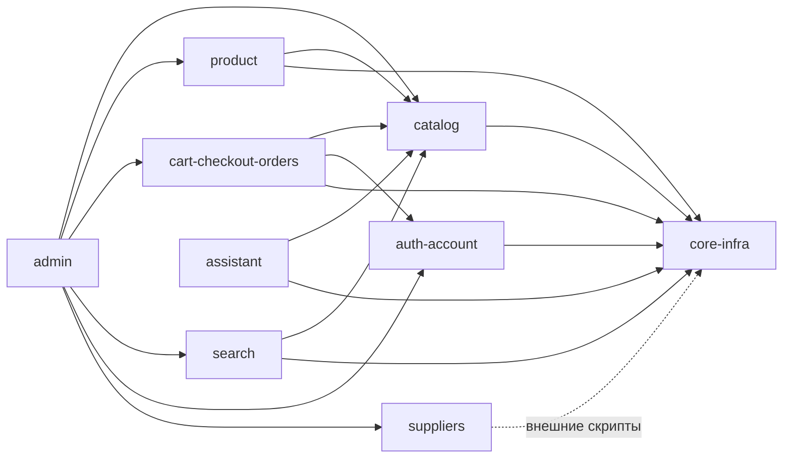

# Архитектура — Elektronom

> Артефакт агента **Architect** (Фаза 3 — Интерпретация) · Reversa · `doc_level=completo` · Язык: Русский
> Связанные: [c4-context.md](c4-context.md) · [c4-containers.md](c4-containers.md) · [c4-components.md](c4-components.md) · [erd-complete.md](erd-complete.md) · [domain.md](domain.md) · [adrs/](adrs/)

## 1. Обзор

**Elektronom** — монолитное приложение **Next.js 16 (App Router)** на TypeScript, развёртываемое на **Vercel**. Архитектура — серверо-центричная: React Server Components + **Server Actions** как слой команд + тонкий слой запросов (`queries/`) и доменной логики (`lib/`) поверх **PostgreSQL через Prisma 7**. Внешние возможности (поиск, изображения, email, AI, генерация контента, оплата) вынесены в управляемые сервисы.

## 2. Архитектурный стиль и слои

```mermaid
flowchart TD
  subgraph Client[Браузер]
    UI[RSC + Client Components<br/>shadcn/Tailwind 4, Zustand UI]
  end
  subgraph Next[Next.js 16 на Vercel]
    direction TB
    Pages[app/[locale]/* — страницы RSC]
    API[app/api/* — route handlers]
    Actions[actions/* — 'use server' команды]
    Queries[queries/* — чтение + 'use cache']
    Lib[lib/* — домен: auth, catalog-*, assistant, storage, algolia]
    I18N[i18n + middleware-less [locale]]
  end
  DB[(PostgreSQL<br/>Prisma 7 adapter-pg)]
  EXT[Внешние сервисы]

  UI -->|navigate / form| Pages
  UI -->|fetch| API
  UI -->|server action| Actions
  Pages --> Queries
  Pages --> Lib
  Actions --> Lib
  Actions --> DB
  Queries --> DB
  Lib --> DB
  API --> Lib
  Lib --> EXT
  API --> EXT
```

**Принципы (выведено из кода):**
- **CQRS-lite:** чтение — `queries/*` (кэшируется `'use cache'`/тегами); запись — `actions/*` (`'use server'`, инвалидация `revalidateTag`).
- **Доменная логика в `lib/`** (фасеты, корзина-merge, auth, ассистент, хранилище) — переиспользуется страницами и действиями.
- **Граница доверия — сервер:** валидация zod на входе всех действий/роутов; данные клиента (cookie-корзина, ответы LLM) перепроверяются на сервере.

## 3. Карта модулей и зависимостей



- **Ядро:** `core-infra` (Prisma, env, storage, i18n, utils) — зависит от всех остальных.
- **Хаб:** `admin` агрегирует почти все домены (god-модуль — тех. долг AD-6).
- **Рудимент:** `suppliers` — фактически внешний (см. [ADR соответствующих находок](domain.md)).

## 4. Потоки данных (ключевые)
1. **Категория → фильтры:** URL → `parseCatalogSearchParams` → параллельно `getFilteredProducts` (SQL) + `getCategoryFacets` (in-memory 50k) → рендер. (риск рассинхрона C-2)
2. **Оформление заказа:** корзина (cookie/БД) → `createOrder` `$transaction` (идемпотентность → списание стока → `OrderCounter` → снапшоты) → очистка корзины. (сильная сторона)
3. **AI-ассистент:** сообщение → keyword-поиск товаров → prompt-stuffing → Anthropic → zod → **регидратация из БД** → лог сессии/стоимости.
4. **Поиск:** Algolia `products_{locale}` с деградацией на Prisma; синхронизация индекса из admin.
5. **Контент:** admin → Content Factory (внешний) → описания товаров.

## 5. Внешние интеграции

| Интеграция | Протокол | Где | Уверенность |
|-----------|----------|-----|-------------|
| PostgreSQL | Prisma/pg | core-infra | 🟢 |
| Algolia | SDK (search/admin) | search | 🟢 |
| Cloudinary | SDK (upload_stream) | core-infra/admin | 🟡 (нет ключей в .env.example) |
| Anthropic Claude | **raw fetch** `/v1/messages` | assistant | 🟢 (ключ вне env-валидации 🔴) |
| Content Factory | REST fetch + token | admin | 🟡 (default localhost:8028) |
| Resend | SDK | (рассылки) | 🟡 (использование при регистрации не найдено) |
| Платёжный провайдер | webhook (`PAYMENT_*`) | — | 🔴 (рантайм-интеграции нет) |
| Google/Facebook OAuth | NextAuth | auth | 🟢 |
| ASKO (поставщик) | внешние скрипты | suppliers | 🟡 |

## 6. Технический долг (приоритизировано)

| Приоритет | Долг | Связь |
|-----------|------|-------|
| 🔴 Высокий | Фасеты in-memory с лимитом 50k → не масштабируется | C-1, ADR-0002 |
| 🔴 Высокий | Оплата не реализована (онлайн-платёж/webhook отсутствуют) | BR-ORD-7 |
| 🔴 Высокий | «RAG» не векторный; embedding-таблицы и sources — мёртвые/плейсхолдеры | AS-1, AS-8 |
| 🔴 Высокий | Нет автотестов/CI при bleeding-edge стеке | inventory |
| 🟡 Средний | Дублирование: фасет-логика (SQL vs in-memory), конфиги фильтров, `getUserOrders` | C-2, C-3, O-7 |
| 🟡 Средний | `admin.ts` god-файл (~1540 строк) | AD-6 |
| 🟡 Средний | Рассинхрон env: `.env.example` ↔ `env.ts`, Anthropic/Content Factory вне валидации | CI-3, CI-4 |
| 🟡 Средний | XSS-риск: `dangerouslySetInnerHTML` описания без явного санитайза | P-1 |
| 🟡 Средний | Неиспользуемая роль MANAGER; нет аудита админ-действий | permissions |
| 🟡 Средний | Пробелы модель↔код: `qty_breaks`, `Address`, `SupplierInventory` | INV-4 |
| 🟢 Низкий | Dev-скрипты в `src/actions/` (мёртвый код, хардкод-пути) | SU-2, SU-3 |
| 🟢 Низкий | Разнобой бренда Electronom/Elektronom | P-5, CI-7 |

## 7. Нефункциональные характеристики (наблюдения)
- **Производительность:** агрессивное кэширование `'use cache'`/тегами; ISR ~2000 страниц товаров; узкое место — фасеты.
- **Безопасность:** zod-валидация, RBAC, защита загрузок от path traversal, prompt-injection фильтры, регидратация LLM. Риски: XSS-описание, IP в открытом виде, ключи вне валидации.
- **Масштабируемость:** ограничена in-memory фасетами и DB-based rate limit ассистента.
- **Наблюдаемость:** `lib/logger` + `instrumentation.ts`; учёт стоимости AI. Нет аудита/метрик бизнес-событий.
- **Надёжность:** транзакции заказов, грациозная деградация поиска. Слабое место — отсутствие тестов.
