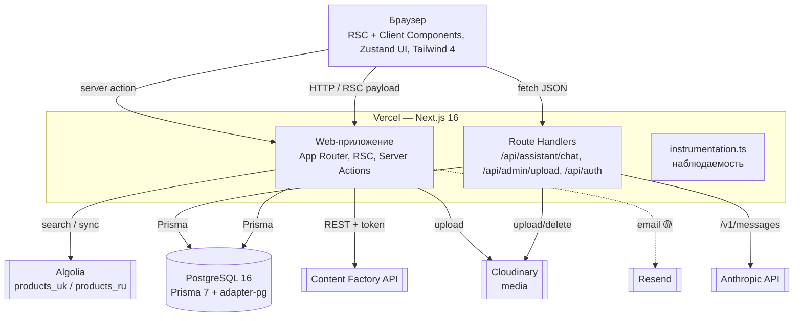

# C4 — Уровень 2: Контейнеры (Elektronom)

> Артефакт **Architect** (`completo`) · Mermaid · 🟢/🟡.

## Контейнеры

| Контейнер | Технология | Ответственность |
|-----------|-----------|-----------------|
| Web-приложение | Next.js 16 RSC + Server Actions | Страницы, доменная логика, команды/запросы |
| Route Handlers | Next.js API routes | AI-чат, загрузка изображений, NextAuth |
| PostgreSQL | Postgres 16 + Prisma 7 (adapter-pg) | Хранилище данных |
| Поисковый индекс | Algolia (2 индекса по локали) | Полнотекстовый поиск (fallback — Prisma) |
| Медиа | Cloudinary (+ локальный `public/uploads` в dev) | Хранение/обработка изображений |
| AI | Anthropic Claude (raw fetch) | Технический ассистент |
| Content Factory | Внешний REST-сервис | AI-генерация описаний |
| Email | Resend | Транзакционные письма (🟡 точки вызова не подтверждены) |

> Нет отдельных контейнеров очередей/кэша/воркеров — кэш данных реализован средствами Next.js (`'use cache'`), фоновых задач нет.
