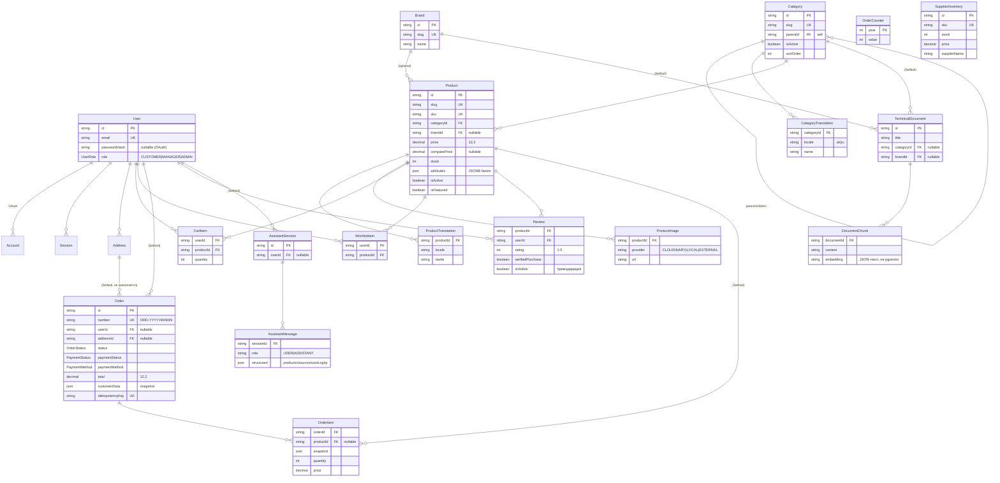

# ERD — полная модель данных (Elektronom)

> Артефакт **Architect** (`completo`) · Mermaid `erDiagram` · 🟢 из `schema.prisma`.

## Кардинальности и заметки
- **Category** — самоссылка (дерево). Переводы 1:N (по locale, уникально `[categoryId, locale]`).
- **Product** N:1 Category, N:0..1 Brand; переводы/изображения/отзывы/позиции — 1:N.
- **Order** N:0..1 User (гостевые заказы), N:0..1 Address (**фактически null**, O-5). `OrderItem.productId` SetNull — заказ переживает удаление товара.
- **SupplierInventory** — **изолирована** (нет FK), связь с Product только по `sku` на уровне внешних процессов (🟡 SU-1).
- **DocumentChunk.embedding** — текст (JSON-массив), не векторный тип (🔴 AS-1).
- Уникальные связки: `Review[productId,userId]`, `WishlistItem[userId,productId]`, `CartItem[userId,productId]`, `Account[provider,providerAccountId]`.
