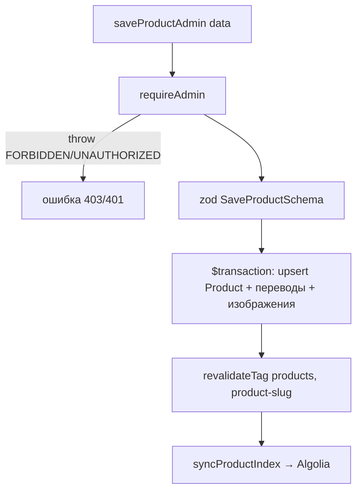
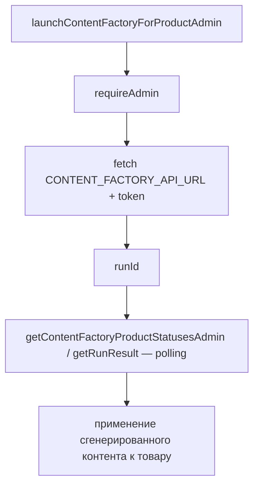
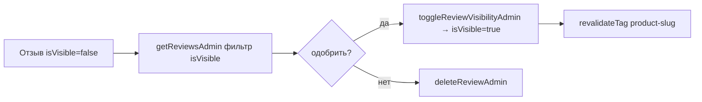

# Flowcharts — модуль `admin`

> Артефакт **Archaeologist** (`completo`) · Mermaid. Уверенность 🟢.

## 1. Сохранение товара (admin)

## 2. Content Factory (AI-генерация контента)

## 3. Модерация отзыва (закрытие цикла премодерации)

## Примечания
- Content Factory по умолчанию `127.0.0.1:8028` (локальный сервис) — находка AD-4.
- Все действия — только роль ADMIN (MANAGER не задействован, AD-5).
