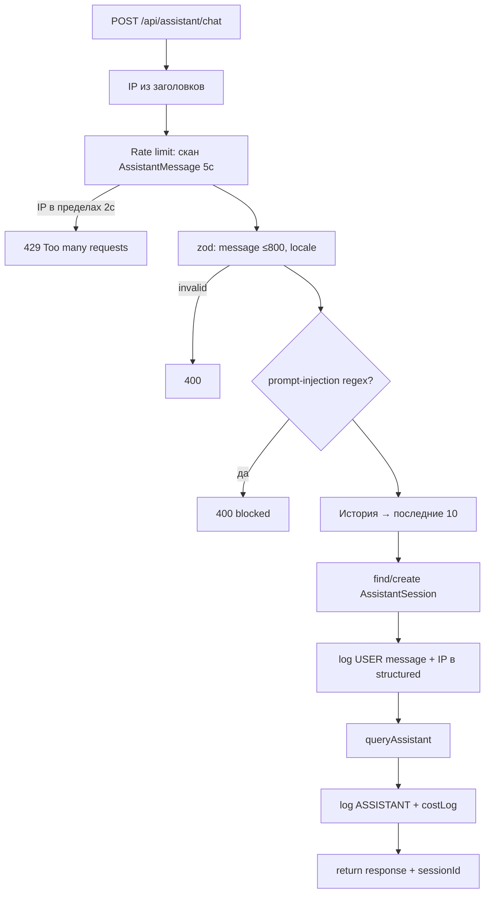
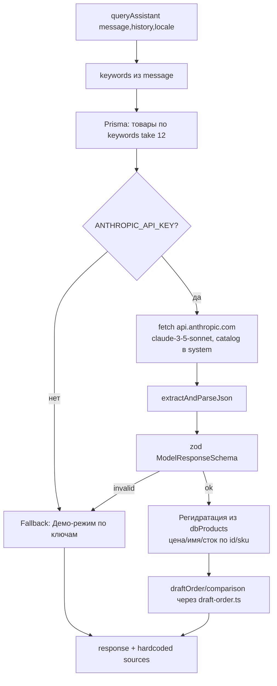

# Flowcharts — модуль `assistant`

> Артефакт **Archaeologist** (`completo`) · Mermaid. Уверенность 🟢.

## 1. Поток обработки сообщения (API + LLM)

## 2. `queryAssistant` — retrieval + LLM + регидратация

## Примечания
- 🔴 Эмбеддинги/`DocumentChunk`/`TechnicalDocument` в потоке НЕ участвуют (AS-1). Диаграмма отражает фактический keyword-retrieval.
- 🟢 Шаг «Регидратация из БД» — ключевая защита от доверия ценам/наличию от LLM (AS-3).
