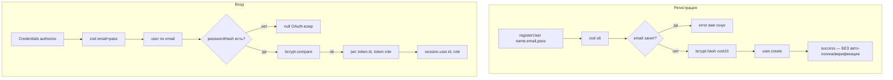
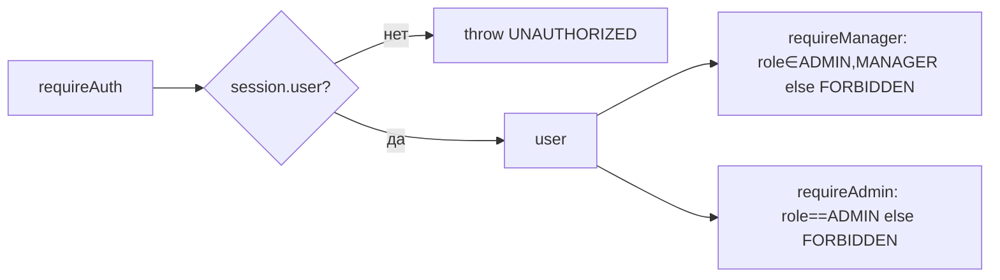
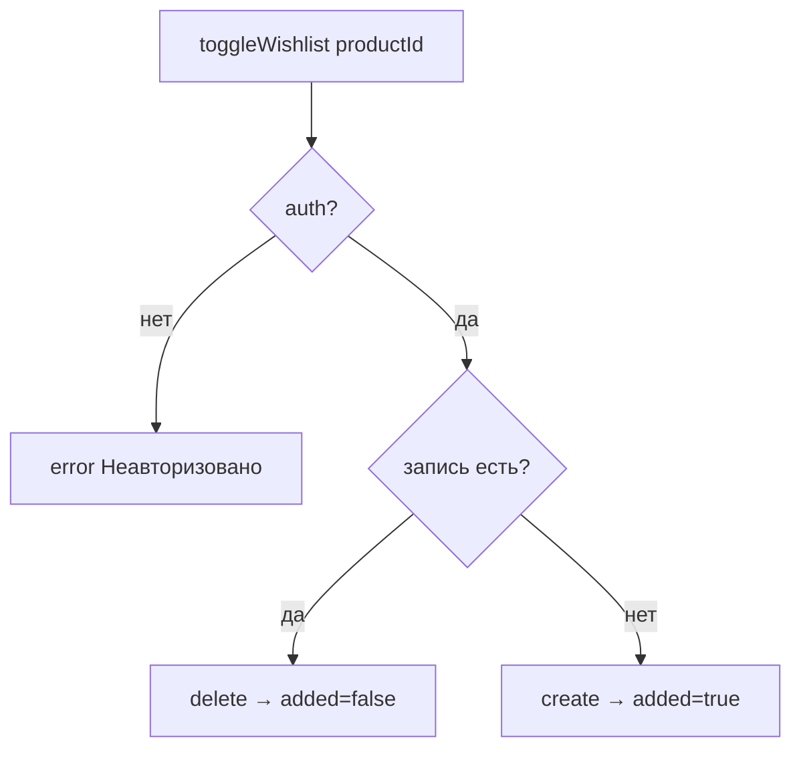

# Flowcharts — модуль `auth-account`

> Артефакт **Archaeologist** (`completo`) · Mermaid. Уверенность 🟢.

## 1. Аутентификация (NextAuth v5)

## 2. RBAC-гейтинг (хелперы)

## 3. Toggle wishlist (идемпотентно)

## Примечания
- Verification email/VerificationToken не задействованы (находка A-2).
- Адреса (`Address`) не управляются действиями (A-1); checkout снапшотит `customerData`.
