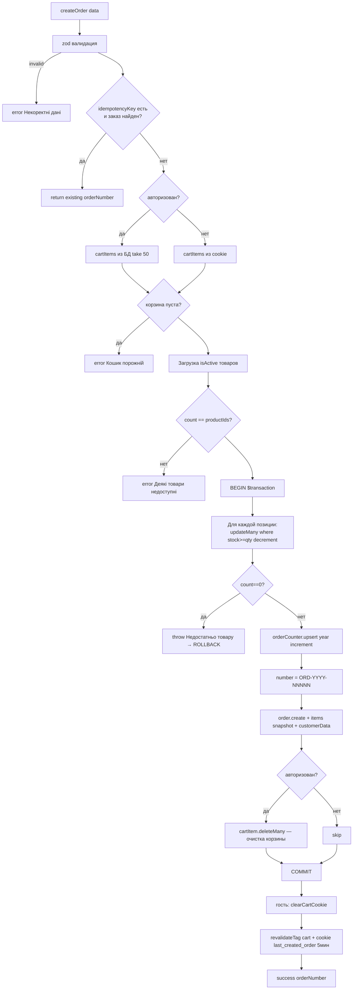
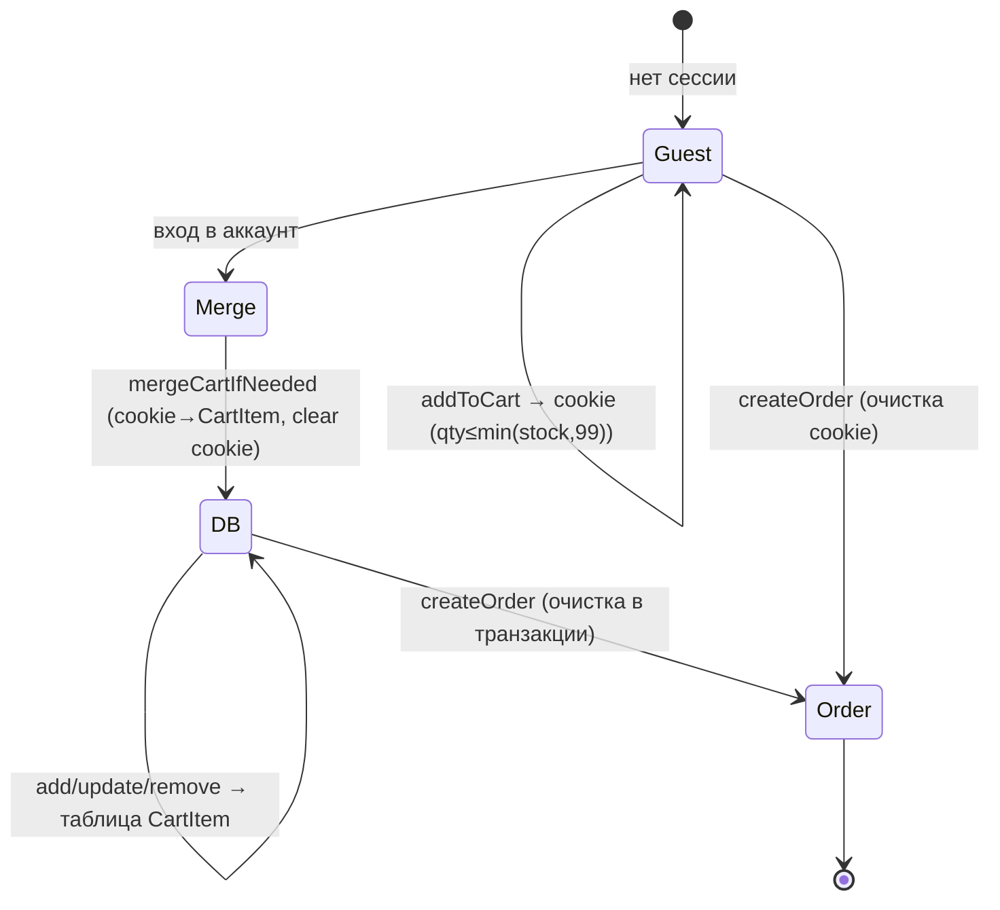
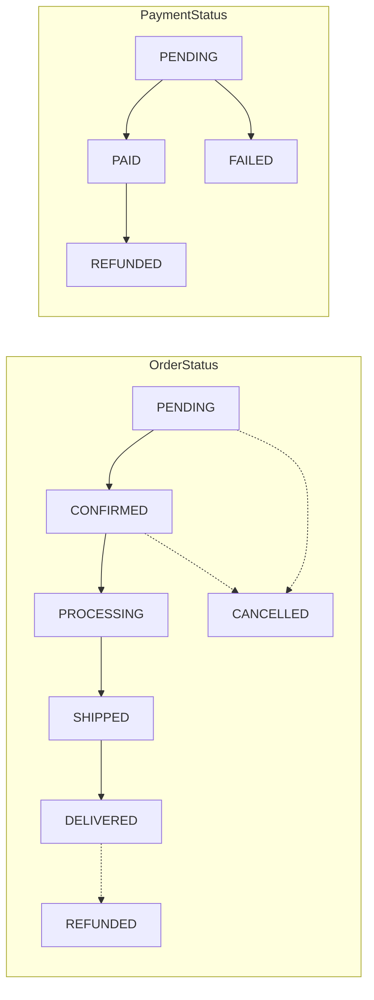

# Flowcharts — модуль `cart-checkout-orders`

> Артефакт **Archaeologist** (`completo`) · Mermaid. Уверенность 🟢.

## 1. `createOrder` — оформление с атомарной транзакцией

## 2. Жизненный цикл корзины (гость ↔ авторизованный)

## 3. Статусы заказа и оплаты (enum-домен)

## Примечания
- Переходы статусов (диаграмма 3) выведены из enum — фактические переходы задаются в admin (модуль admin), здесь показан логичный домен 🟡.
- `paymentStatus` остаётся PENDING (онлайн-оплата в `createOrder` не инициируется, находка O-8).
