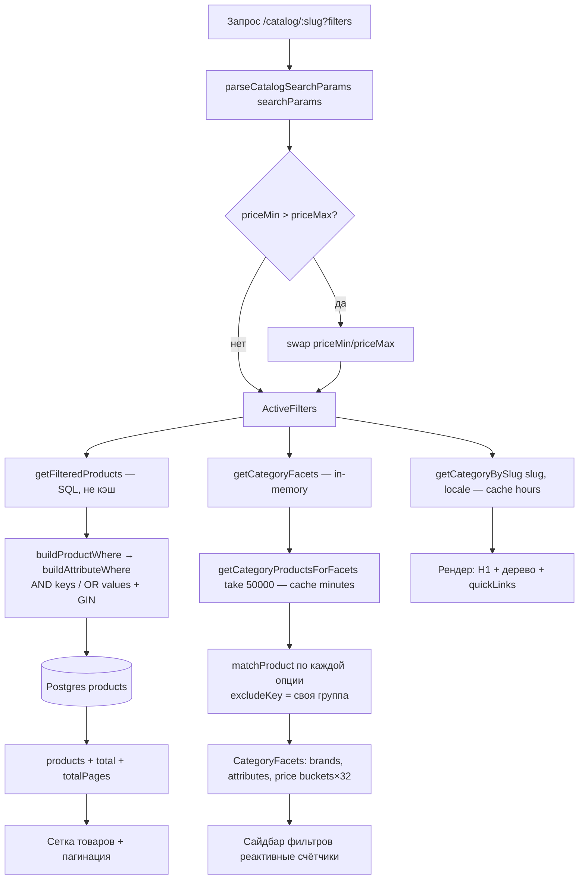
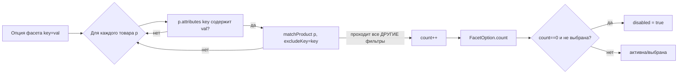
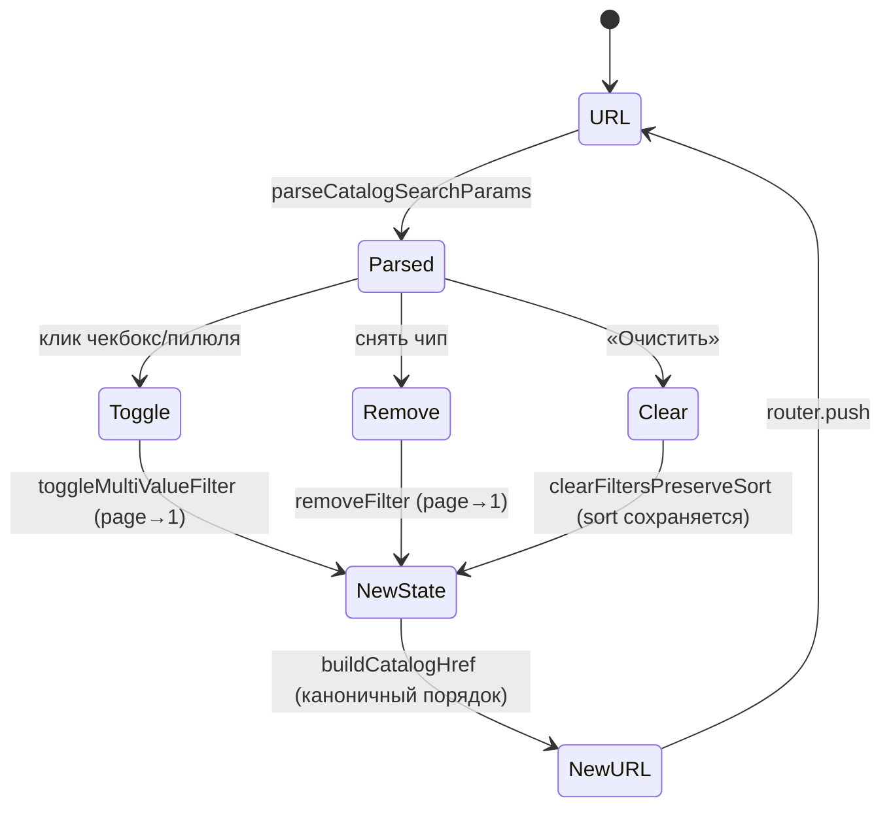

# Flowcharts — модуль `catalog`

> Артефакт **Archaeologist** (`completo`) · Mermaid. Уверенность 🟢 (из кода).

## 1. Рендер страницы категории `(shop)/catalog/[slug]`

## 2. Реактивный счётчик фасета (приём «exclude self»)

## 3. Жизненный цикл состояния фильтров (URL — источник истины)

## Примечания
- Пути списка (SQL) и счётчиков (in-memory) расходятся по реализации — диаграмма 1 показывает оба; синхронность логики критична (находка C-2).
- `page` сбрасывается при любой мутации фильтра (диаграмма 3).
