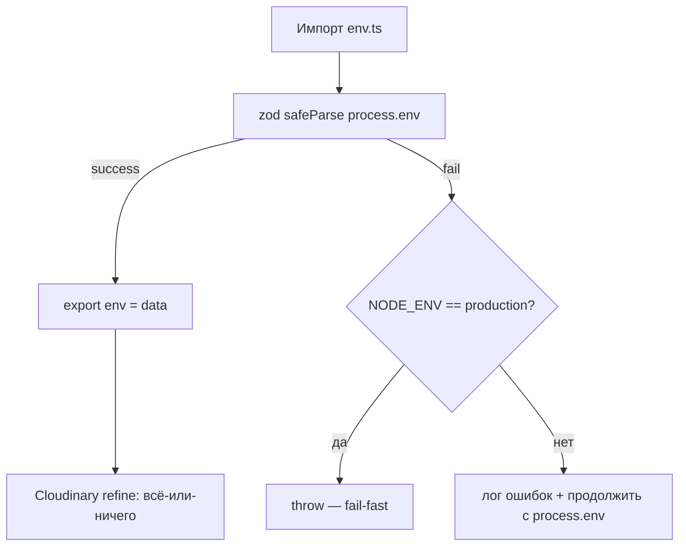
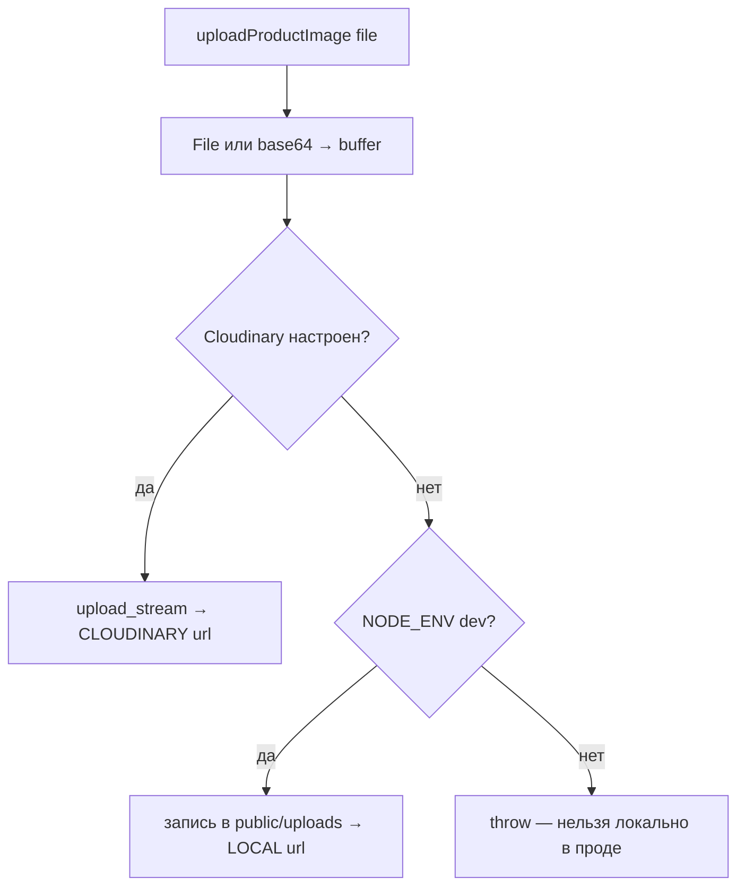
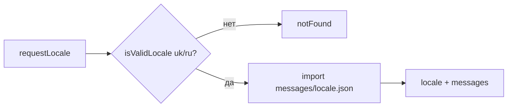

# Flowcharts — модуль `core-infra`

> Артефакт **Archaeologist** (`completo`) · Mermaid. Уверенность 🟢.

## 1. Валидация окружения (старт приложения)

## 2. Выбор провайдера хранилища изображений

## 3. Резолв локали (next-intl)

## Примечания
- 🟡 `ANTHROPIC_API_KEY`, `CONTENT_FACTORY_*` не проходят через схему `env.ts` (CI-3) — диаграмма 1 не покрывает их.
- 🟢 Удаление локальных файлов защищено от path traversal (как в upload-роуте).
