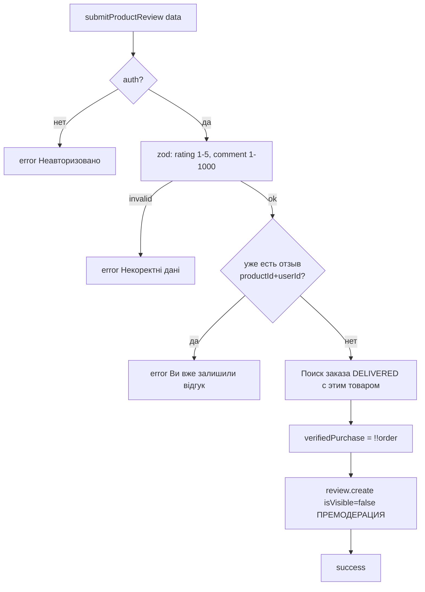

# Flowcharts — модуль `product`

> Артефакт **Archaeologist** (`completo`) · Mermaid. Уверенность 🟢.

## 1. Рендер карточки товара `(shop)/product/[slug]`

```mermaid
flowchart TD
  A[Запрос /product/:slug] --> B[isValidLocale?]
  B -- нет --> N[notFound]
  B -- да --> C[getProductBySlug slug, locale — cache seconds]
  C -- null --> N
  C --> D[auth → currentUser]
  C --> E[Парсинг attributes:<br/>qty_breaks vs displayAttrs]
  D & E --> F[Hero: галерея + цена/скидка/наличие + AddToCart]
  F --> G{qty_breaks.length>0?}
  G -- да --> H[QtyBreaksTable: base×(1−discount/100)]
  C --> I[ProductSchema JSON-LD]
  C --> J[ProductReviews initial=видимые отзывы]
  C --> K[Suspense: SameSeriesProducts]
  C --> L[Suspense: RelatedProductsSection]
```

## 2. Отправка отзыва `submitProductReview`



## Примечания
- `isVisible=false` ⇒ отзыв не появится в выдаче, пока админ не одобрит (модуль admin).
- `qty_breaks` берётся из JSONB `attributes`, не из отдельной таблицы (находка P-2/C-4).
