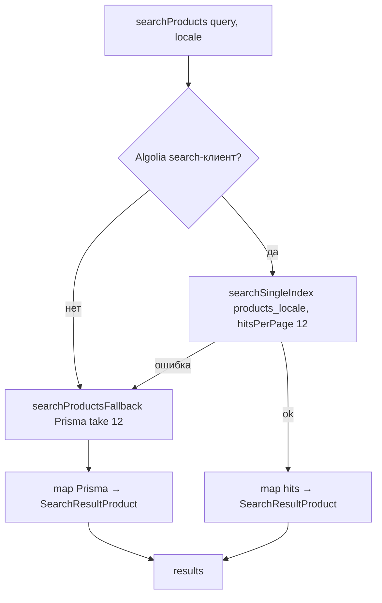
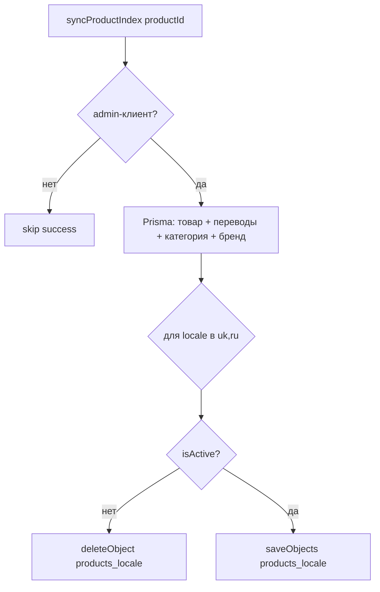

# Flowcharts — модуль `search`

> Артефакт **Archaeologist** (`completo`) · Mermaid. Уверенность 🟢.

## 1. Поиск с деградацией

## 2. Синхронизация индекса (из admin)

## Примечания
- Дрейф индекса возможен, если `syncProductIndex` не вызывается при каждом изменении товара (SE-4).
