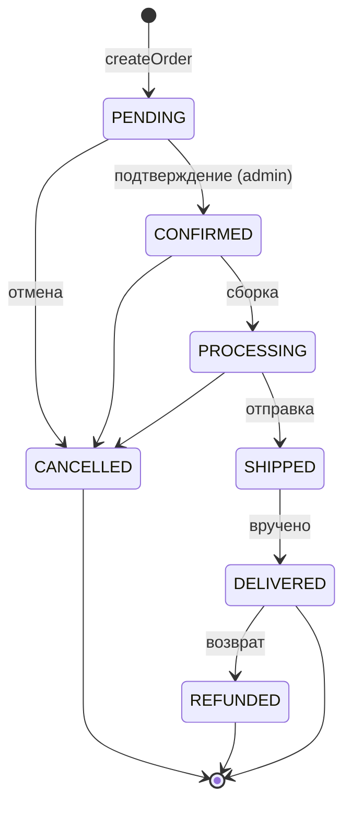
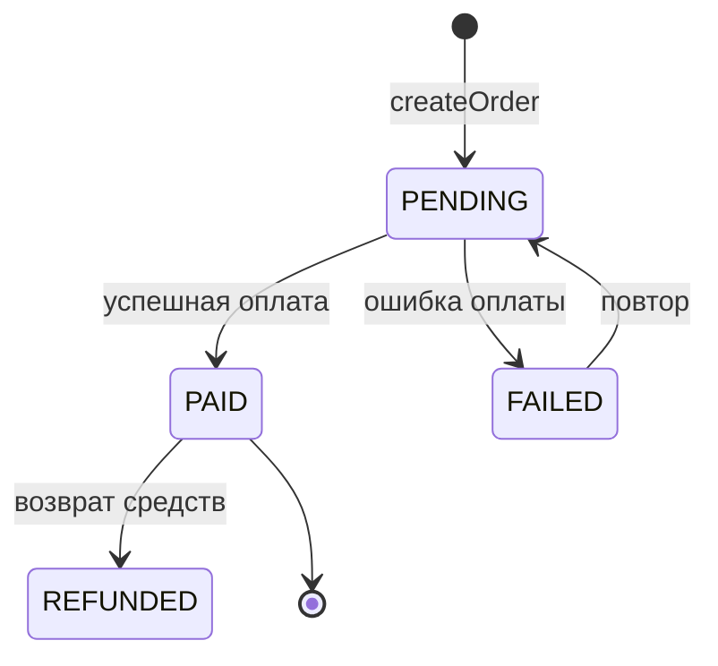
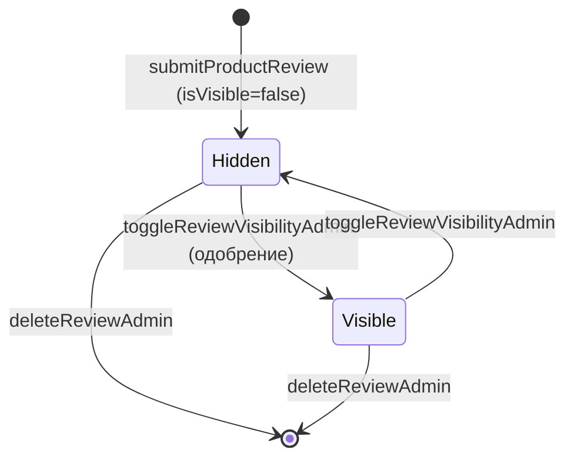
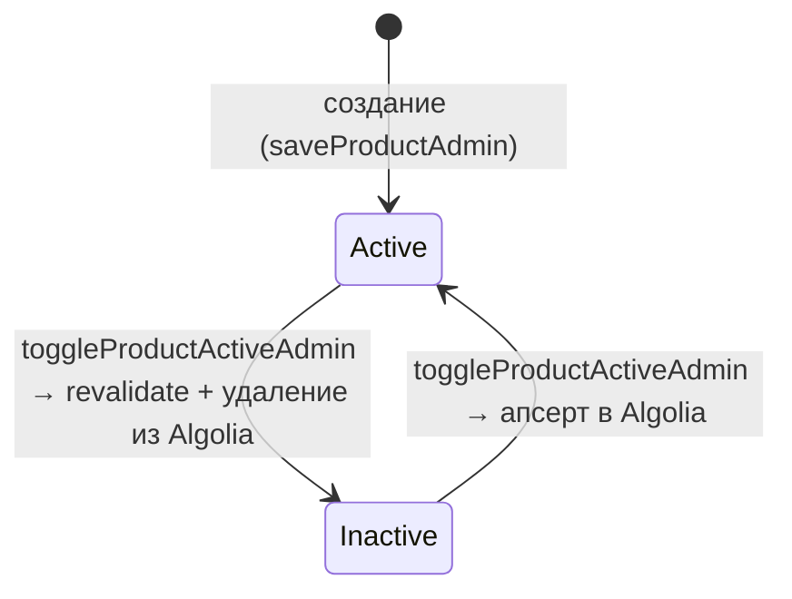
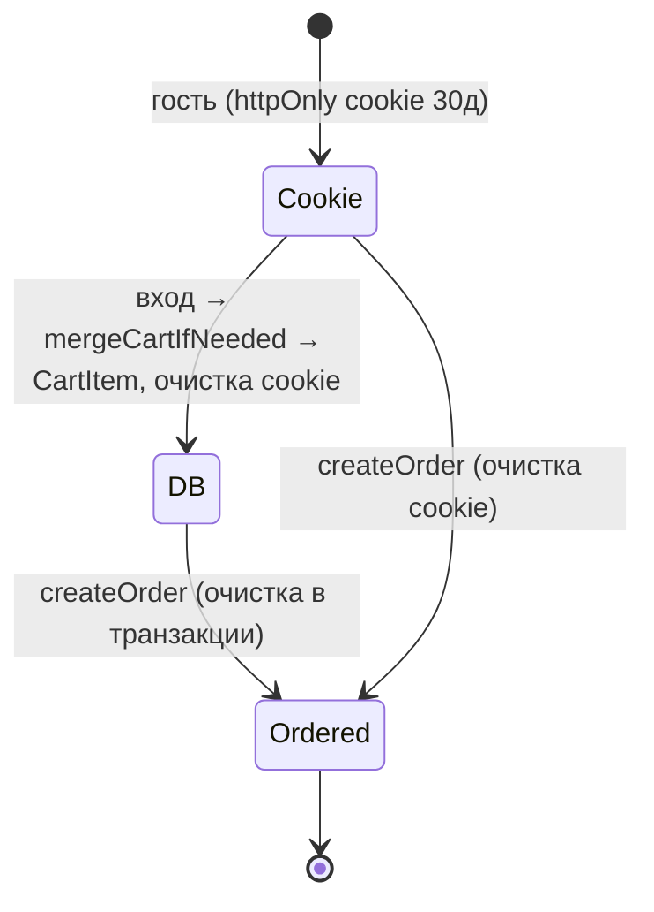

# Машины состояний — Elektronom

> Артефакт агента **Detective** (`completo`) · Reversa · Mermaid.
> 🟢 значения статусов — из enum (схема); 🟡 переходы — выведены (явной машины переходов в коде нет, статусы меняет `updateOrderStatusAdmin` без ограничений).

## 1. Заказ — `OrderStatus`

Значения (🟢): `PENDING`, `CONFIRMED`, `PROCESSING`, `SHIPPED`, `DELIVERED`, `CANCELLED`, `REFUNDED`.

> 🔴 **Лакуна:** `updateOrderStatusAdmin(orderId, status)` принимает **любой** `OrderStatus` без проверки допустимости перехода. Диаграмма — рекомендуемая модель, а не реализованное ограничение. Также `DELIVERED` влияет на `verifiedPurchase` отзывов (BR-PR-4).

## 2. Оплата — `PaymentStatus`

Значения (🟢): `PENDING`, `PAID`, `FAILED`, `REFUNDED`.

> 🔴 В рантайме переходы `PaymentStatus` **не инициируются** (нет интеграции онлайн-оплаты/webhook). Остаётся `PENDING` (BR-ORD-7).

## 3. Видимость отзыва — `Review.isVisible`

## 4. Активность товара — `Product.isActive`

> 🟢 Переход в `Inactive` синхронно удаляет товар из поискового индекса; обратно — апсертит (BR-IDX-1).

## 5. Жизненный цикл корзины (гость ↔ авторизованный)

## Методические замечания
- Машины 1–2 описывают **домен enum**; их переходы не закодированы как guard'ы — это риск (несогласованные статусы возможны вручную).
- Рекомендация Architect/Writer: вынести допустимые переходы `OrderStatus` в явную таблицу/функцию-guard.
