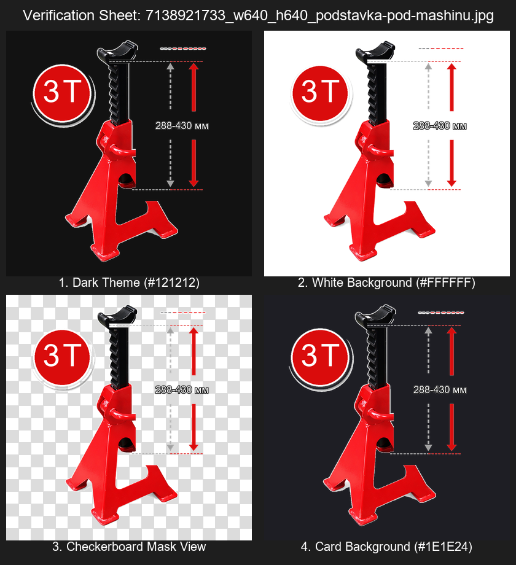
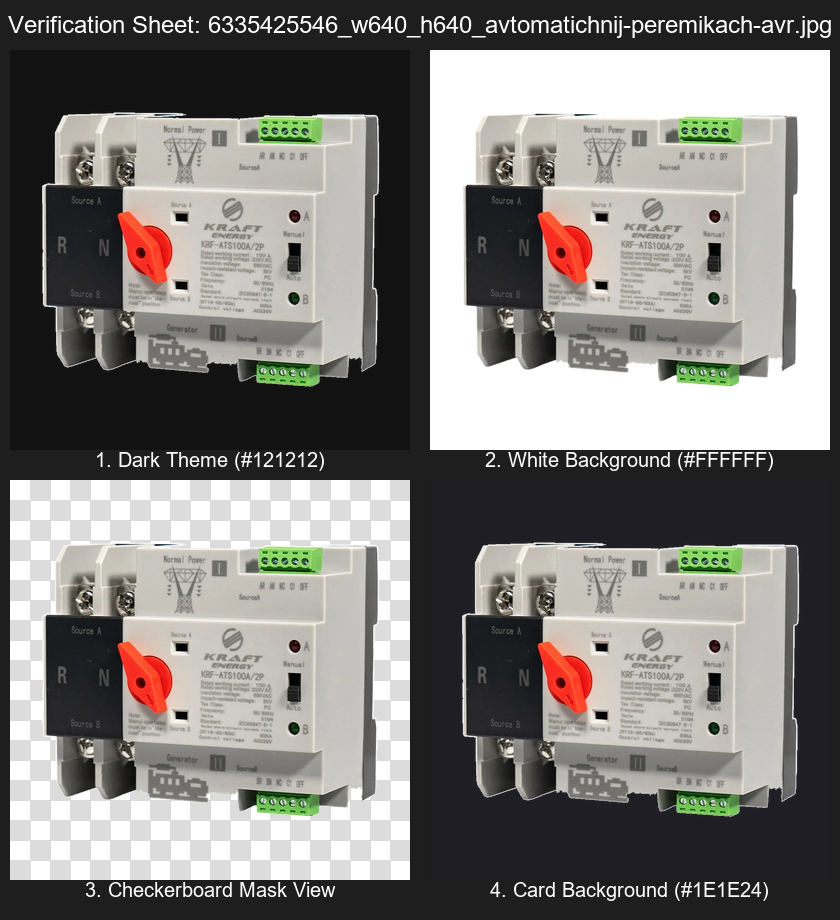
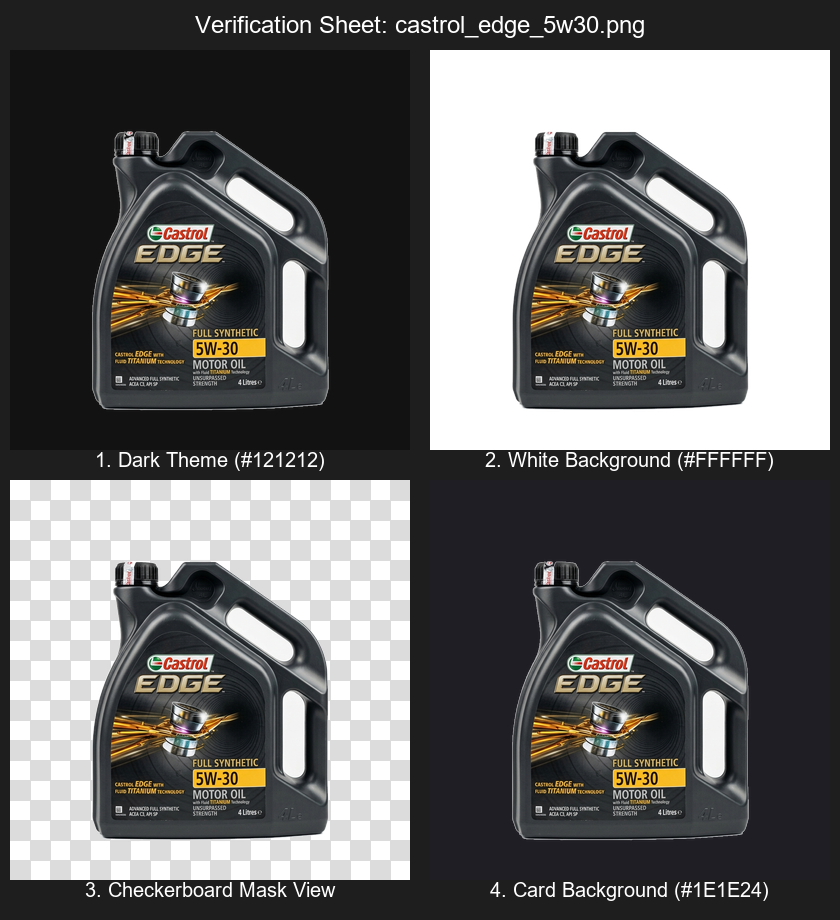

# Background Removal Tool: Verification & Delivery Report

Date: 2026-05-26  
Workspace: `c:\Users\sevri\Сайт\elektronom`  

Covers all issues from reviews up to [REVIEW_HYBRID_BG_REMOVAL_FINAL_RECHECK_2026-05-26.md](file:///c:/Users/sevri/Сайт/elektronom/REVIEW_HYBRID_BG_REMOVAL_FINAL_RECHECK_2026-05-26.md).

---

## 1. Fixes Applied

### ✅ Expanded Annotation Clearing & Gap Closure
* Clearing area in `redraw_jack_stand_annotations` expanded to `x in [540, 980]`.
* Connection zones also cleared (`x in [430, 540]` at `y: 120–136`; `x in [525, 540]` at `y: 654–670`).

### ✅ Transparent White Clearing (black rectangle fix)
* Clearing pixel changed from `(0, 0, 0, 0)` to `(255, 255, 255, 0)` in `redraw_jack_stand_annotations`.
* Eliminates black-panel artefact in viewers that ignore the alpha channel.

### ✅ `normalize_transparent_pixels()` — global postprocess
* New NumPy-vectorised function applied after **every** pipeline method (BFS, neural, skip, no-corners fallback).
* Guarantees all transparent pixels are `(255, 255, 255, 0)` — no transparent-black leaks ever.

### ✅ Hybrid pipeline: `analyze_complexity()` + `choose_method()`
* `analyze_complexity()` computes a weighted score 0.0–1.0 from 5 metrics: background variance, edge density, corner mismatch, foreground confidence risk, shadow risk.
* `choose_method()` applies priority chain: `skip > config.method > CLI --method > auto`.
* `redrawAnnotations: true` always forces BFS in auto mode (TZ §8).

### ✅ Neural backend: `remove_bg_neural()` (lazy import)
* `rembg` is lazy-imported only when `method=neural` — never breaks a run without it.
* Three unavailability modes: `warn-fallback` (default), `error`, `skip`.
* Result is normalised via `normalize_transparent_pixels()`.

### ✅ New CLI flags
`--method auto|bfs|neural`, `--complexity-threshold`, `--neural-unavailable`, `--write-report`, `--report-path`

### ✅ JSON processing report (`--write-report`)
* Per-image: `method`, `methodSource`, `complexityScore`, `threshold`, `reasons`, `fallback`, `status`, `durationMs`.

### ✅ `requirements-neural.txt` (separate optional file)
* `rembg>=2.0.56` and `onnxruntime>=1.17.0` — not in main `requirements.txt`.

### ✅ P1 fix: `if not valid_corners` returns dict
* Previously: bare `return` → `None` → `decision.get(...)` crash in `main()`.
* Now: normalises, saves, sets `fallback="no light corners, copied as-is"`, fills `durationMs`, **returns `method_decision` dict**.

### ✅ `__pycache__` and `.pyc` removed
* Cleaned from `tools/image-bg-removal/` and `tools/image-bg-removal/tests/`.

### ✅ README updated
* New section **"Optional Neural Background Removal"** with install, auto, force-neural, force-bfs, per-image config examples.

---

## 2. Test Execution Log

```txt
$ python -m unittest discover -s tools/image-bg-removal/tests -v

# test_hybrid_pipeline: 24 tests — all OK
# test_remove_bg:        5 tests — all OK

----------------------------------------------------------------------
Ran 29 tests in 47.320s

OK
```

### Test coverage breakdown

| File | Tests | Description |
|------|-------|-------------|
| `test_hybrid_pipeline.py` | 6 | `analyze_complexity` — score bounds, white bg, noisy bg, metrics keys |
| `test_hybrid_pipeline.py` | 9 | `choose_method` — config/CLI/auto priority, neural unavailability modes |
| `test_hybrid_pipeline.py` | 4 | Neural backend (mocked rembg — no real install required) |
| `test_hybrid_pipeline.py` | 5 | Transparent RGB invariant (BFS e2e, neural mock, jack stand regression) |
| `test_remove_bg.py` | 1 | All real fixtures processed correctly |
| `test_remove_bg.py` | 1 | Annotation region 94.3% transparent |
| `test_remove_bg.py` | 1 | ROI fully clean (no digit-2 residue) |
| `test_remove_bg.py` | 1 | Redraw flag isolation |
| `test_remove_bg.py` | 1 | **P1 regression**: dark-corner image returns dict, not None |

---

## 3. Visual Verification Sheets

The 4-way comparison cards show the cleaned products on Dark, White, Checkerboard, and Card backgrounds.

### 1. Jack Stand Diagram (with --redraw-annotations)
* Output Image: [output/7138921733_w640_h640_podstavka-pod-mashinu.png](output/7138921733_w640_h640_podstavka-pod-mashinu.png)
* Verification Card: [comparisons/comp_7138921733_w640_h640_podstavka-pod-mashinu.png](comparisons/comp_7138921733_w640_h640_podstavka-pod-mashinu.png)



---

### 2. AVR Switch (Pure Background Removal)
* Output Image: [output/6335425546_w640_h640_avtomatichnij-peremikach-avr.png](output/6335425546_w640_h640_avtomatichnij-peremikach-avr.png)
* Verification Card: [comparisons/comp_6335425546_w640_h640_avtomatichnij-peremikach-avr.png](comparisons/comp_6335425546_w640_h640_avtomatichnij-peremikach-avr.png)



---

### 3. Castrol Canister (Pure Background Removal)
* Output Image: [output/castrol_edge_5w30.png](output/castrol_edge_5w30.png)
* Verification Card: [comparisons/comp_castrol_edge_5w30.png](comparisons/comp_castrol_edge_5w30.png)


