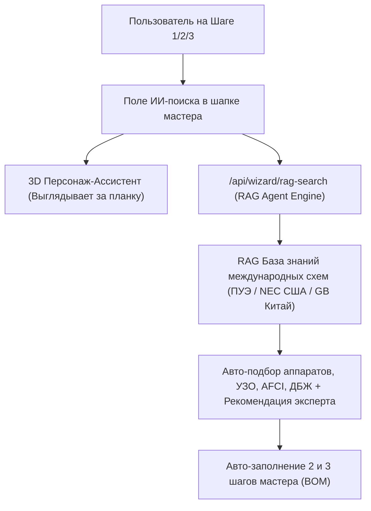

# Технологическое ТЗ: RAG-Агентный ИИ Поиск & 3D Ассистент в Мастере подбора

## 1. Общий обзор архитектуры

---

## 2. Разделение задачи на 3 Модуля (Parts)

### 🎨 Модуль 1: Frontend UI & 3D Персонаж (Интерфейс поиска)
* **Размещение**: Шапка мастера (`GuidedWizardModal.tsx`), прямо над прогресс-баром (выделено на скриншоте).
* **3D Персонаж**: Робот-электрик в каске (`/images/ai-mascot-peeking.png`), позиционированный с отрицательным смещением (`-top-9 right-6`), эффект «выглядывания из-за планки поиска».
* **Интерактивные чипы быстрого поиска**:
  * ⚡ *«Деревянный дом (AFCI + Противопожарное УЗО)»*
  * 💧 *«Ванная & Бассейн (10mA Type A)»*
  * 🔋 *«Автономия котла на 12 часов (LiFePO4)»*
  * ⚡ *«3 Фазы 380V с защитой от обрыва нуля»*

### 🧠 Модуль 2: RAG Агент & База Знаний Схем (International Standards)
* **США (NEC / NFPA 70)**:
  * Обязательная защита от дугового пробоя (AFCI / Arc Fault) для спален и деревянных конструкций.
  * Разделение нейтрали (N) и защитного заземления (PE) на вводном щите (Bonding Jumper).
* **Европа & Украина (ПУЭ 7 / ДБН В.2.5-23:2010 / IEC 60364)**:
  * Двухступенчатая дифзащита: Вводное селективное УЗО `300mA S` + Линейные УЗО/Дифы `30mA / 10mA Type A`.
  * Обязательное Реле Напряжения (ZUBR/DigiTOP) с задержкой повторного включения для компрессоров.
* **Китай & Азия (GB 50054 / GB 50096)**:
  * Промышленные гибридные инверторы с быстрой передачей 10ms (UPS Mode).
  * Балансировка LiFePO4 аккумуляторов и требования к DC-автоматам 1000V для солярных панелей.

### 💾 Модуль 3: Интеграция БД на `E:\сайт` и связка с GitHub
* Локальный реестр верифицированных схем в `docs/rag_knowledge_base/schemas_international_rules.json`.
* API роут `src/app/api/wizard/rag-search/route.ts` с верифицированным парсингом условий.
* Пуш всех файлов и связей прямо в репозиторий GitHub `main`.
